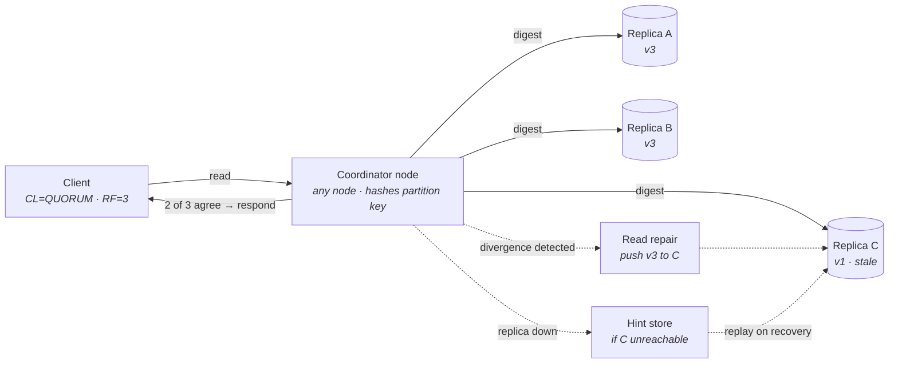
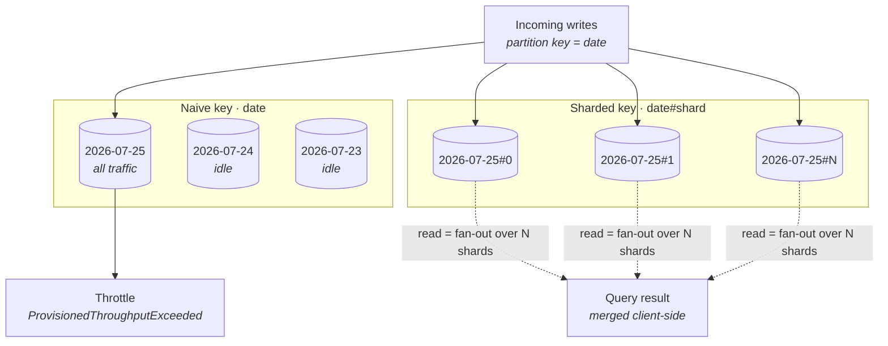
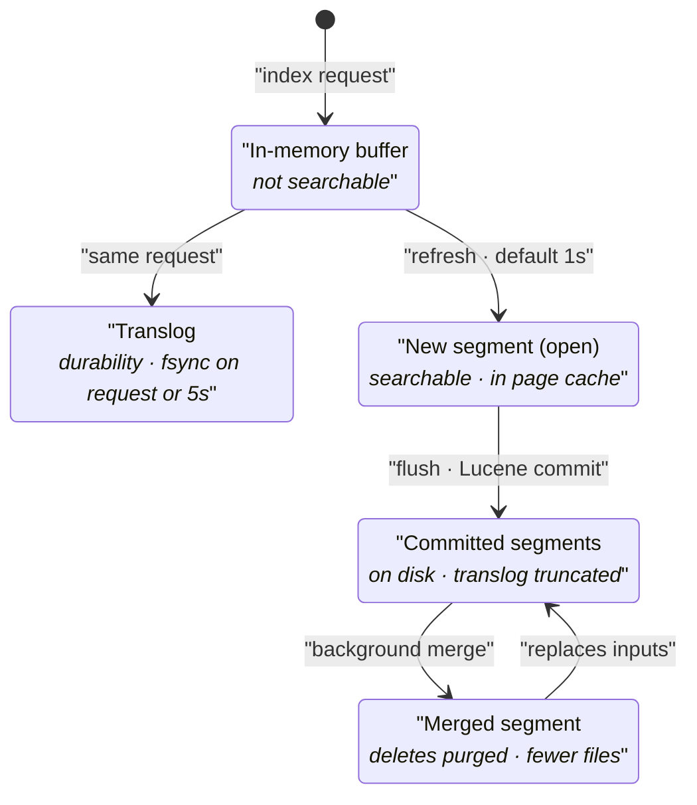
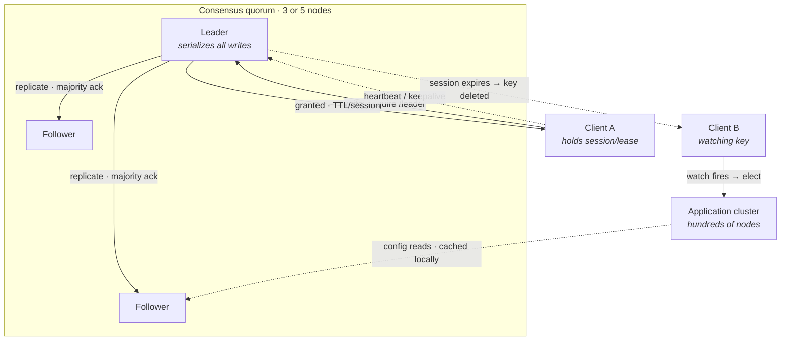
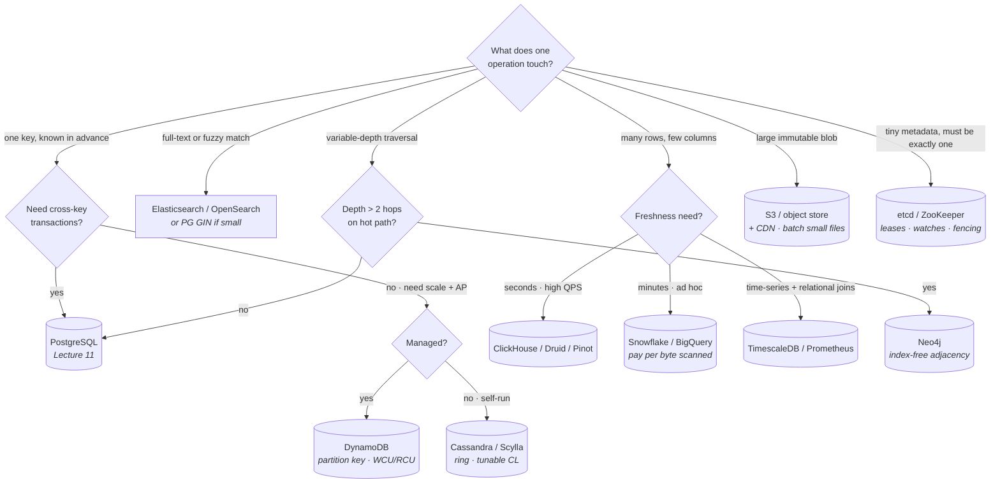

# Other Components Worth Knowing at Depth

Lectures 11–13 went deep on three engines. This one is deliberately broader and shallower — for each remaining component class, enough to reason about fit, name the internals that drive its trade-offs, and know when it is the wrong choice.

The bar here is not implementation-level mastery. It is that when you write a box on the whiteboard labelled *Cassandra* or *Elasticsearch* or *S3*, you can immediately say what its placement model is, which one or two internals decide its behaviour under load, what knob you would turn, and what it will do to you at 3am. That is exactly the depth a staff-level interview probes, and it is the depth at which most candidates are thinnest.

## The axes every component is placed on

Before the profiles, fix the vocabulary. Every store in this lecture is a different answer to the same five questions, and if you can answer these five for a component you can reason about it live.

- **Placement model** — how does a key or document map to a machine? Consistent hashing ring, explicit partition key hashing, range partitioning, or a metadata service that assigns arbitrarily. This determines rebalancing cost and hot-spot behaviour.
- **Storage engine shape** — LSM tree or B-tree, row-major or column-major, immutable segments or mutable pages. Lecture 4 derived the consequences; here you only need to *name* the shape and read off the implications: LSM means write-optimised, compaction debt, and read amplification; columnar means scan-optimised and update-hostile.
- **Consistency and replication model** — leader-based, leaderless with quorums, or single-writer-per-shard. Whether the client can choose per operation. Whether reads can be stale, and by how much.
- **The capacity unit** — what you actually provision and pay for. Nodes, shards, partitions, request units, bytes scanned, or slots. Cost models are not a business detail; they change the *design*, because a system priced per byte scanned makes partitioning a correctness-adjacent concern.
- **The characteristic failure mode** — every system has one signature way it degrades. Hot partition, compaction backlog, mapping explosion, small-file problem, watch storm. Knowing the signature is worth more than knowing the architecture diagram.

**Rule of thumb:** if you cannot name a component's characteristic failure mode, you do not yet know it well enough to put it in a design. Architecture diagrams are shared by systems that behave nothing alike.

## Wide-column and key/value stores

The family that trades away joins, cross-key transactions, and ad-hoc query flexibility for predictable single-key latency at horizontal scale. The shared premise: *you know the access pattern before you design the schema*, and the schema is built around the query rather than around the entities.

### Cassandra — the ring

- **Placement** — a consistent-hashing **ring** with virtual nodes (`num_tokens`, typically 16–256 per physical node). Every node owns many small token ranges rather than one large one, so adding a node steals a slice from *many* peers concurrently instead of splitting one neighbour's range. This is the whole reason bootstrap is fast and rebalancing is even.
- **No leader, no shard master.** Any node can serve any request as **coordinator**; it hashes the partition key, finds the replicas from the ring, and fans out. This is what makes Cassandra survivable: there is no single node whose loss stalls a key range.
- **Data model** — partition key determines placement; clustering columns determine *sort order within the partition*. A partition is the unit of co-location, the unit of atomicity, and the unit of read efficiency. A query that specifies the partition key and a clustering-column range is a single seek plus a sequential read. A query that does not specify the partition key is a scatter to every node in the cluster, and Cassandra will make you write `ALLOW FILTERING` to admit it.
- **Storage engine** — LSM: writes go to the commit log plus an in-memory memtable, memtables flush to immutable SSTables, SSTables merge by compaction. See Lecture 4 for why this shape favours writes. The practical consequence is that Cassandra's write path is nearly constant-time and its read path is *variable*, because a read may need to consult several SSTables plus the memtable and merge the results by timestamp.
- **Conflict resolution is last-write-wins on cell timestamps.** There is no read-modify-write, no compare-and-set (outside lightweight transactions), and no way for the system to detect that two writes conflicted. Clock skew between clients is therefore a *data-loss* mechanism, not a nuisance.

**Tunable consistency — the part interviews actually care about:**

- Every read and write carries a **consistency level**: `ONE`, `QUORUM`, `LOCAL_QUORUM`, `EACH_QUORUM`, `ALL`, and the write-only `ANY`.
- The guarantee is arithmetic, not magic: with replication factor `RF`, you get read-your-writes-style strong consistency exactly when `R + W > RF`. `QUORUM` read plus `QUORUM` write with `RF=3` gives `2 + 2 > 3` — overlapping replica sets, so the read sees the write.
- **`LOCAL_QUORUM` is the multi-region default in practice.** `QUORUM` across three regions means every write waits for a cross-region round trip. `LOCAL_QUORUM` keeps latency in-region and accepts that cross-region replication is asynchronous — which means a region failover can lose recent writes. That is a deliberate, statable trade, and stating it is the point.
- **The trap:** `R + W > RF` gives you *monotonic-ish freshness*, not isolation. Two concurrent read-modify-writes at `QUORUM` still both win and one silently overwrites the other. If you need actual compare-and-set, you need **lightweight transactions** (Paxos per partition, four round trips) and you should expect roughly an order of magnitude latency increase. Use them for a signup-uniqueness check, not on the hot path.

**Anti-entropy — three mechanisms, and they are not interchangeable:**

- **Hinted handoff** — a coordinator that cannot reach a replica stores a hint locally and replays it when the replica returns. Covers brief blips only; hints expire (`max_hint_window_in_ms`, default 3 hours) and are dropped after that.
- **Read repair** — when a read at `QUORUM` finds divergent replicas, the coordinator pushes the newest version back. Repairs only data that is *actually read*, so cold data drifts forever.
- **Full repair** (`nodetool repair`) — Merkle-tree comparison between replicas, the only mechanism that converges cold data. It is expensive, it must be run within `gc_grace_seconds` (default 10 days), and if you skip it, **deleted data resurrects**. Tombstones are garbage-collected after `gc_grace_seconds`; a replica that missed the delete and was never repaired will re-propagate the old row.

- **The coordinator is not special** — it is whichever node the driver chose, ideally a replica itself (token-aware drivers route to a replica to save a hop).
- **Quorum answers as soon as `R` replicas agree** — the third response is not on the latency path, which is why `QUORUM` at `RF=3` is only modestly slower than `ONE` in the common case and much more robust in the tail.
- **Read repair is opportunistic**, triggered by the read, not by a schedule. Cold partitions are the ones that diverge, and they are precisely the ones read repair never touches.
- **Hints are a bridge, not a guarantee.** Past the hint window, only full repair converges the cluster.

**Compaction strategy is the single most consequential operational choice:**

| Strategy | Best for | Read amplification | Space amplification | Signature pain |
|---|---|---|---|---|
| **`SizeTieredCompactionStrategy` (STCS)** | write-heavy, append-mostly | high (many overlapping SSTables) | **high — needs ~50% free disk** | a huge SSTable that never compacts again; disk exhaustion mid-compaction |
| `LeveledCompactionStrategy` (LCS) | read-heavy, frequent updates to the same rows | **low — ~1 SSTable per level** | low (~10% overhead) | continuous background I/O; falls behind under write bursts and never recovers |
| `TimeWindowCompactionStrategy` (TWCS) | **time-series with TTL** | low if queries are time-bounded | low | out-of-order or updated writes break window locality entirely |

- **Default is STCS**, and it is the wrong default for most read-heavy workloads. LCS trades write I/O for read predictability.
- **TWCS is the correct answer for TTL'd time-series** because whole SSTables expire together and can be dropped without compacting — no tombstone accumulation at all.
- **The failure mode to name:** *compaction cannot keep up*. Pending compactions climb, SSTable-per-read count climbs, p99 read latency climbs, and the fix (more compaction throughput) competes with the writes that caused it. This is a debt spiral, and the only real escape is reducing write rate or adding nodes.

**Do not reach for Cassandra when:** you need cross-partition transactions, joins, or ad-hoc queries; when your access pattern is not known in advance; when your data has high update or delete rates (tombstones are Cassandra's most common self-inflicted outage); or when you have fewer than a handful of nodes, at which point a replicated relational database is simpler and faster.

### DynamoDB — partition keys and request units

Same ancestral design as Cassandra, opposite operational philosophy: you never see the ring, and the system's constraints are exposed to you as *capacity* rather than as nodes.

- **Key model** — a **partition key** (hashed, decides placement) and an optional **sort key** (orders items within the partition). Together they form the primary key. The partition key is *the* design decision: it fixes both the distribution of load and the set of queries that are cheap.
- **Query versus scan** — `Query` requires the exact partition key and optionally a sort-key condition; it is O(matching items). `Scan` reads the whole table. A design that requires `Scan` on the hot path is a design error, not a tuning problem.
- **Item size limit is 400 KB**, and a partition (the physical storage unit) caps at **10 GB**. Exceed 10 GB for a single partition-key value and you cannot split it — the key is the split boundary. This is why unbounded per-key collections must be sharded into the key itself.

**Capacity: WCU and RCU, and why they shape the schema:**

- **1 WCU** = one write of up to 1 KB per second. A 3 KB item costs 3 WCU. Transactional writes cost **double**.
- **1 RCU** = one *strongly consistent* read of up to 4 KB per second, or **two** eventually consistent reads. Transactional reads cost double.
- **Eventually consistent reads are half price and the default.** Strongly consistent reads go to the leader replica, cost 2× the RCU, and are unavailable across regions in global tables. Choosing eventual consistency for a feed and strong consistency for a balance check is exactly the kind of per-operation reasoning to demonstrate.
- **On-demand versus provisioned** — on-demand is roughly 5–7× the per-request price of well-utilised provisioned capacity, but has no capacity planning and no throttling from misprediction. Provisioned plus autoscaling is cheaper at steady state and *worse* at spikes, because autoscaling reacts over minutes.

**Hot partitions — the characteristic failure mode:**

- Throughput is provisioned at the table level but **enforced at the partition level**. Historically each partition got `total / partitions` and a hot key throttled while the table sat idle overall.
- **Adaptive capacity** now shifts unused throughput toward hot partitions automatically, and *isolates* a sustained hot key onto its own partition. This makes moderate skew survivable.
- **It does not save you from a single hot key.** Adaptive capacity redistributes across partitions; it cannot exceed the per-partition ceiling (roughly 3000 RCU / 1000 WCU). One celebrity user, one `status = "ACTIVE"` key, one date-only partition key on the current day — these still throttle.
- **What to do instead:** **write sharding** — append a bounded random or hash suffix to the partition key (`user#123#7` with suffixes 0–9), then fan out reads across the suffixes. You pay a 10× read fan-out to buy a 10× write ceiling. Say the number.

- **The upper diagram is the single most common DynamoDB mistake** — a monotonically increasing or low-cardinality partition key concentrates all writes on one physical partition regardless of table-level capacity.
- **Adaptive capacity helps the middle of the distribution**, not the extreme. It buys headroom for skew; it does not raise the per-partition ceiling.
- **Sharding moves cost from writes to reads** — deliberately. Choose `N` from the write rate you need divided by the per-partition write ceiling, and no larger, because every extra shard is another query on every read.
- **Sort keys are free leverage** — a composite sort key (`ORDER#2026-07#status`) turns a range condition into a single efficient query and often removes the need for an index entirely.

**Secondary indexes — GSI and LSI, and the differences that matter:**

- **LSI (local secondary index)** — same partition key, different sort key. Shares the partition's capacity and its **10 GB limit**. Supports strongly consistent reads. **Must be created with the table and can never be added.** That last property alone makes LSIs a poor bet.
- **GSI (global secondary index)** — completely different partition key. It is, physically, a **separate table maintained asynchronously**. Add or drop at any time.
- **GSIs are eventually consistent, always.** There is no strongly consistent GSI read.
- **GSIs have their own WCU/RCU**, and every base-table write that touches projected attributes consumes GSI write capacity too. Under-provisioning a GSI **throttles writes to the base table** — the propagation backs up and back-pressures. This is a genuinely surprising failure mode and a good thing to name unprompted.
- **Projection choice is a real cost lever** — `KEYS_ONLY`, `INCLUDE`, or `ALL`. `ALL` doubles your storage and write cost; `KEYS_ONLY` forces a second read to hydrate the item.

**DynamoDB Streams:**

- An ordered, per-partition-key change log of item-level modifications, retained **24 hours**. Records carry `NEW_IMAGE`, `OLD_IMAGE`, or both, at your configuration.
- **Ordering is guaranteed per partition key only** — the same guarantee shape as Lecture 13's per-partition ordering. Never assume global ordering.
- The standard consumer is Lambda with shard-level parallelism; the standard failure is a poison-pill record blocking a shard until the retention window drops it. Configure a failure destination.
- **Streams are what makes DynamoDB composable** — they power global tables, materialised aggregates, search indexing into Elasticsearch, and the outbox pattern from Lecture 6, all without dual writes.

**Do not reach for DynamoDB when:** queries are exploratory or change frequently; when you need joins or aggregates (you will end up maintaining them by hand through Streams); when a single logical entity attracts unbounded write concentration you cannot shard; or when you are cost-sensitive at very high sustained throughput, where a self-managed store on reserved instances is meaningfully cheaper.

### ScyllaDB and HBase as points of contrast

Useful precisely because they hold most of the design fixed and vary one axis.

- **ScyllaDB — same data model, different runtime.** Cassandra's API and storage design, reimplemented in C++ on a **shard-per-core, shared-nothing** architecture (Seastar): each core owns a slice of the node's data, its own memory, and its own scheduler, with no cross-core locking. It bypasses the page cache with its own unified cache and does its own I/O scheduling.
  - **The payoff** — 2–10× throughput per node and dramatically better p99, mostly by eliminating JVM GC pauses and cross-core contention. Fewer, larger nodes for the same workload.
  - **The lesson to draw:** Cassandra's tail latency problem was substantially an *implementation* problem, not a model problem. When you criticise a system, separate the two.
  - **What it does not fix** — the tombstone problem, the last-write-wins conflict model, or the requirement to design around the partition key. Those are model-level.
- **HBase — the opposite placement choice.** Built on HDFS, HBase **range-partitions** the key space into regions, each owned by exactly one RegionServer, with region assignment coordinated through ZooKeeper and a master.
  - **Strongly consistent** by construction: one server owns a range, so there is a single writer per key and no quorum arithmetic. You get read-your-writes for free.
  - **Range partitioning gives you efficient ordered scans** — a genuine capability Cassandra's hashed placement cannot offer across partitions.
  - **It also gives you sequential-key hot-spotting.** A timestamp or auto-increment prefix concentrates all writes on the last region. The standard fix is **salting** the row key, which then destroys the scan locality you chose HBase for. Recognise the circularity.
  - **The characteristic failure mode** is availability, not latency: a RegionServer death makes its regions unavailable until reassignment and WAL replay complete — seconds to minutes. HBase chose C over A where Cassandra chose A over C, and that is the cleanest CP/AP contrast in the practical landscape (Lecture 2).

## Document and search

Two systems that look similar from the outside — JSON in, JSON out, schema-flexible — and are internally almost opposites: one is a replicated B-tree store with a document API, the other is an inverted-index engine with immutable segments.

### MongoDB — replica sets and sharding

- **Data model** — BSON documents in collections. Embedding related data in one document buys single-document atomicity and one-read retrieval; referencing buys normalisation and unbounded growth. **The 16 MB document limit** makes unbounded embedded arrays a design bug that surfaces months later.
- **Storage engine** — WiredTiger: B-tree (with an LSM option nobody uses), document-level concurrency control, MVCC snapshots, and compression on by default. This is why MongoDB's update behaviour resembles a relational engine more than it resembles Cassandra's.

**Replica sets — the availability unit:**

- One **primary** accepts all writes; **secondaries** replicate the primary's **oplog** (a capped collection of idempotent operations). Automatic failover by Raft-like election (Lecture 2) on primary loss, typically 10–12 seconds by default.
- **Election needs a majority**, so an even-sized set gains nothing over the odd size below it. Arbiters are members that vote without holding data — and using one to make 2 members vote as 3 is a known way to lose data, since a genuine majority of *data-bearing* nodes no longer exists.

**Write concern and read preference — the two knobs to know cold:**

- **Write concern `w`** — `w: 1` acknowledges on the primary only and can lose the write on failover. **`w: "majority"`** is the durable setting: acknowledged only when a majority of the set has it, which is the condition under which a rollback cannot occur. `j: true` additionally requires the journal fsync.
- **`w: "majority"` is the default in modern versions**, and this is the right default. If someone proposes `w: 1` for throughput, the question to ask is "which writes are you willing to lose during an election?"
- **Read preference** — `primary` (default, linearizable-ish), `primaryPreferred`, `secondary`, `secondaryPreferred`, `nearest`. Reading from secondaries buys read scale and costs freshness; replication lag is unbounded under load.
- **The trap:** secondary reads do not reduce write load, and the secondaries are applying the same write volume as the primary. Reading from secondaries scales reads only until replication apply becomes the bottleneck — and when it does, your reads get *stale*, not slow, which is much harder to alert on. Use `maxStalenessSeconds`.
- **Causal consistency sessions** give you read-your-writes across a primary write and a secondary read without paying for primary reads. Worth naming; frequently forgotten.

**Sharding:**

- A sharded cluster is: **`mongos`** routers (stateless), **config servers** (a replica set holding chunk metadata), and **shards** (each itself a replica set).
- **Shard key choice is irreversible in spirit** — resharding exists in recent versions but is an expensive online migration, not a config change.
  - **Hashed shard key** — even distribution, no range queries.
  - **Ranged shard key** — range queries work, monotonic keys hot-spot on the last chunk. Same trade as HBase in [§ ScyllaDB and HBase as points of contrast](#scylladb-and-hbase-as-points-of-contrast).
- **Chunks split and migrate automatically** via the balancer. Migrations consume I/O on both source and target; a balancer running during peak is a classic self-inflicted latency incident. Schedule balancing windows.
- **Multi-document transactions exist** (since 4.0 on replica sets, 4.2 sharded) and work — but a distributed transaction across shards is two-phase commit with all of Lecture 2's costs. Their existence is not a licence to model as if MongoDB were relational.

**Do not reach for MongoDB when:** your data is genuinely relational with many-to-many joins; when you need strong analytical query capability; or — most importantly — when the reason cited is "flexible schema", because flexible schema at write time is rigid schema enforcement scattered across application code at read time.

### Elasticsearch / OpenSearch — segments, refresh, and merge

A distributed inverted-index engine wrapped around Lucene. Almost every operational surprise follows from one fact: **Lucene segments are immutable.**

- **Placement** — an index is split into a fixed number of **primary shards** at creation; each shard is a full Lucene index; each has some number of **replica shards**. A document routes to a shard by `hash(routing_key) % number_of_primaries`, which is why the primary count is immutable — changing it would invalidate every routing decision.
- **Inverted index** — term → posting list of document IDs (plus positions and frequencies). This is what makes full-text search fast and what makes Elasticsearch a *search* engine rather than a document store that happens to have a `LIKE` operator.
- **Doc values** — a columnar, on-disk structure written alongside the inverted index, used for sorting, aggregations, and scripted access. Aggregations read doc values, not the inverted index; this is why aggregation memory behaviour is completely different from query behaviour.

- **Refresh makes documents visible; flush makes them durable.** These are different operations with different intervals and conflating them is the most common Elasticsearch misunderstanding. Durability comes from the translog, which is fsync'd per request by default — search visibility comes from refresh, which is every `1s` by default.
- **This is why Elasticsearch is "near real-time"** — a just-indexed document is durable immediately but invisible for up to one refresh interval. `?refresh=wait_for` blocks until the next refresh; `?refresh=true` forces one and is a throughput disaster if called per document.
- **Refresh is not free** — each refresh creates a segment. Bulk-loading with `index.refresh_interval: -1` and then a single refresh at the end is the standard 2–5× ingest speedup, and re-enabling it afterward is the standard thing people forget.
- **Deletes and updates are not in-place.** A delete writes a tombstone bit; an update indexes a new document and tombstones the old. Space is reclaimed only at merge, so an update-heavy index carries a permanent deleted-document tax visible as `deleted_docs` in `_cat/segments`.
- **Merging is the background debt-collector** and it competes with indexing for I/O. Merge throttling exists (`indices.store.throttle`) and the failure mode is the same spiral as Cassandra compaction: too many small segments, rising search latency (every segment is searched), merges falling behind.

**Shard sizing — the guidance that carries most of the operational value:**

- **Target 10–50 GB per shard.** Below ~10 GB and per-shard overhead dominates; above ~50 GB, recovery, rebalancing, and merge times become painful.
- **Every shard is a Lucene index with fixed overhead** — file handles, memory for segment metadata, a thread on every search. **Aim for well under 20 shards per GB of JVM heap.**
- **Over-sharding is the more common error than under-sharding.** A search hits every shard; a query across 1000 tiny shards is 1000 tasks queued on the search thread pool, and the response is as slow as the slowest one — a textbook tail-at-scale amplifier (Lecture 8).
- **Time-based indices plus ILM** (hot/warm/cold/frozen, rollover on size or age) is the standard log/metrics pattern, because dropping an old index is instant while deleting old documents by query is a full reindex-grade operation.

**Mapping explosions — the named failure mode:**

- **Dynamic mapping** infers a field type from the first document containing it. Convenient, and a live grenade.
- If keys are *data* — `{"user_9f3a": true}`, `{"metric.request_id_x": 1}` — every document adds fields to the mapping. The cluster-state mapping grows without bound, cluster state updates get large and slow, and the master node ends up the bottleneck for the entire cluster.
- **The symptom is a cluster-wide stall**, not a slow query. Mapping lives in cluster state, which is replicated to every node on every change.
- **What to do instead:** set `index.mapping.total_fields.limit` (default 1000) deliberately, set `dynamic: strict` or `dynamic: false` on production indices, and model high-cardinality keys as **nested key/value pairs** — `[{"name": "user_9f3a", "value": true}]` — which turns unbounded fields into unbounded *documents*, which is a problem Elasticsearch is actually built for.
- **`nested` has its own cost** — each nested object is a hidden separate Lucene document, so a parent with 100 nested children is 101 documents. Bound it.

**Do not reach for Elasticsearch when:** it would be your system of record (it has no transactions, and a mapping mistake can require full reindex from source — always keep the source elsewhere); when you need joins beyond `nested`/`join` field limitations; or when the requirement is "search a database column" and a PostgreSQL GIN index on `tsvector` would do, which is more often than architecture diagrams suggest.

## Analytical stores

Columnar, scan-optimised, and structured around the assumption that queries read many rows and few columns (Lecture 3's axis, applied at cluster scale). The interesting split within the family is *who owns the storage*.

### Real-time OLAP — ClickHouse, Druid, Pinot

The shared goal: sub-second aggregation over freshly ingested data, at concurrency higher than a warehouse supports.

- **ClickHouse** — the simplest model of the three and increasingly the default.
  - **`MergeTree` engine family** — data is written as immutable *parts*, sorted by an `ORDER BY` key, merged in the background. Structurally an LSM tree over columnar data.
  - **The sorting key is the index.** ClickHouse's primary index is *sparse* (one entry per `index_granularity`, default 8192 rows) — it does not point at rows, it points at granules to scan. This is why the index is tiny enough to stay in memory even for trillion-row tables, and why choosing `ORDER BY` correctly matters more than anything else you will do.
  - **Partitioning (`PARTITION BY`) is for data management, not query speed** — it enables cheap partition drops for retention. Over-partitioning (per-hour on a small table) creates too many parts and degrades everything.
  - **No real transactions, eventual deduplication.** `ReplacingMergeTree` deduplicates *at merge time*, whenever that happens — so `FINAL` (expensive) or aggregation-that-tolerates-duplicates is required for correctness in the interim. Inserts should be batched (thousands of rows); one-row inserts create one part each and the merge system collapses.
  - **Distribution is explicit** — `Distributed` tables fan out to shards, `ReplicatedMergeTree` replicates via ZooKeeper/ClickHouse Keeper. Joins across shards are weak; the idiom is denormalised wide tables.
- **Druid** — built for time-partitioned event data with a role-segregated architecture.
  - Data is **segments**: time-chunked, columnar, with bitmap indexes on dimensions and pre-aggregated ("rollup") metrics at ingest time.
  - Distinct node roles — *historical* (serves immutable segments), *middle-manager/peon* (ingests real-time), *broker* (scatter-gather), *coordinator* (segment balancing), plus a metadata store and ZooKeeper. Powerful and operationally heavy.
  - **Rollup at ingest is the differentiator** — trading raw-event fidelity for orders-of-magnitude storage and query reduction. It is also irreversible.
- **Pinot** — closest to Druid, aimed at user-facing analytics at high QPS.
  - Rich per-column index choice: inverted, sorted, **star-tree** (a pre-aggregation structure that trades storage for bounded query latency), range, and bloom.
  - **Upserts on real-time tables** — a genuine differentiator over Druid, at the cost of keeping the primary-key map in memory per partition.
- **Common shape across all three:** ingest from Kafka (Lecture 13), columnar immutable segments, a broker that scatter-gathers to segment servers, and background merge/compaction. Once you see that, the choice is about indexing features and operational cost, not about a fundamentally different design.

**Reach for real-time OLAP when:** dashboards or user-facing analytics need sub-second responses over data seconds old, at hundreds or thousands of QPS. **Do not reach for it when** you need joins across large fact tables, transactional correctness, or ad-hoc exploration over arbitrary history — a warehouse is better at all three.

### Snowflake and BigQuery — separated storage and compute

The architectural idea that reorganised the warehouse market: **object storage holds the data, ephemeral compute is attached and detached at will**, and the two scale and are billed independently.

- **Snowflake** — three layers: cloud services (metadata, optimisation, transactions, security), **virtual warehouses** (independent compute clusters), and storage in S3/GCS/Blob as immutable **micro-partitions** (~50–500 MB compressed, columnar, with per-column min/max metadata).
  - **Micro-partition pruning is the entire performance model.** The optimiser skips partitions whose min/max ranges cannot satisfy the predicate. If your filter column correlates with load order, pruning is excellent; if not, you scan everything. **Clustering keys** re-sort data to restore correlation, and cost credits continuously to maintain.
  - **Multiple warehouses over one copy of data** is the killer feature: ETL, BI, and data science each get isolated compute with no contention and no data duplication. This solves the resource-isolation half of the HTAP problem from Lecture 3 by brute force.
  - **Zero-copy cloning and time travel** fall out of immutable storage plus metadata pointers — a full-database clone is a metadata operation.
- **BigQuery** — serverless: no cluster to size at all. Dremel-style execution over a shuffle tier, Colossus for storage, Capacitor as the columnar format.
  - **The pricing model *is* the design constraint.** On-demand billing is per **byte scanned**, and columns not referenced are not scanned. Therefore: never `SELECT *`; partition by ingestion date or a date column so `WHERE` prunes; cluster on high-cardinality filter columns; and materialise repeated aggregations.
  - **A single careless query is a real financial event.** Set `maximum_bytes_billed` per query and custom quotas per project. This is a design control, not an admin footnote.
  - **Slots (reservations)** are the alternative: flat-rate capacity where queries queue rather than cost more. The choice between on-demand and reservations is precisely the choice between variable cost and variable latency.

**The general lesson worth stating in an interview:** when storage and compute separate, *the unit of cost stops being the machine and starts being the work*. Design shifts from "size the cluster" to "reduce bytes touched" — which is why partitioning, clustering, and column pruning become first-class design decisions rather than tuning.

## Object and file storage

### S3 — the semantics that actually matter

Treat S3 as a **distributed key/value store for large immutable blobs with an HTTP API**, not as a filesystem. Every mistake with S3 comes from the filesystem mental model.

- **Flat namespace.** There are no directories. `logs/2026/07/25/a.json` is a single key that happens to contain slashes; the console synthesises folders from common prefixes. `ListObjects` with a delimiter is a *scan of the key space*, not a directory read.
- **Object semantics** — objects are immutable and replaced wholesale. There is no append, no partial write, no rename. A "rename" is a copy plus a delete, and it costs a full copy.
- **Consistency — this changed and you must not quote the old answer.** Since December 2020, S3 provides **strong read-after-write consistency for all operations** — PUTs of new objects, overwrites, and DELETEs — plus strongly consistent LIST. The old eventual-consistency-on-overwrite caveat, and every workaround built for it (DynamoDB-backed consistency layers, S3Guard, EMRFS consistent view), is obsolete.
- **What is still *not* guaranteed:** there is no compare-and-swap across a whole bucket beyond conditional writes on a single key, no cross-object atomicity, and no multi-object transaction. Two concurrent PUTs to the same key: last writer wins, with no way to detect the conflict unless you use conditional headers (`If-None-Match` for create-if-absent, `If-Match` on ETag for optimistic concurrency). Those conditional writes are the primitive behind lakehouse table formats.
- **Versioning** turns overwrite-and-delete into append-only, at the cost of paying for every version. A `DELETE` under versioning writes a *delete marker*; the data is still billed. Lifecycle rules must expire noncurrent versions or your bucket grows forever while appearing to shrink.

**Performance and prefix scaling:**

- **Per-prefix rate limits: at least 3,500 PUT/COPY/POST/DELETE and 5,500 GET/HEAD requests per second**, and prefixes scale horizontally without limit — more distinct prefixes, more aggregate throughput.
- **S3 auto-partitions the key space over time**, so a sudden burst on a new prefix can throttle (HTTP 503 `SlowDown`) until partitioning catches up. Retry with exponential backoff and jitter (Lecture 8) — this is expected behaviour, not a fault.
- **The historical advice to randomise the key *prefix* is obsolete** for correctness but the underlying principle survives: **spread load across many prefixes**. A date-first key layout (`2026/07/25/...`) concentrates today's traffic on one prefix path; a shard-or-hash component higher in the key spreads it.
- **The small-object problem** — S3 is priced and engineered for large objects. Millions of 2 KB objects cost more in *requests* than in storage, and any job that lists and reads them is dominated by per-request latency (tens of ms each). **Batch small objects into larger ones**; this is why every analytics format targets 128 MB–1 GB files.
- **Multipart upload** for anything above ~100 MB (mandatory above 5 GB): parallel parts, per-part retry, and resumability. Set a lifecycle rule to abort incomplete multipart uploads — orphaned parts are invisible in listings and billed indefinitely, and this is one of the most common silent AWS cost leaks.

**Cost — four independent dimensions, and design touches all of them:**

- **Storage per GB-month**, varying by class: Standard, Intelligent-Tiering, Standard-IA, Glacier Instant/Flexible/Deep Archive. IA and Glacier carry **minimum object sizes (128 KB) and minimum storage durations** (30/90/180 days) — transitioning small or short-lived objects to IA costs *more*, not less.
- **Requests** — PUT ~10× the price of GET per request. Listing is a PUT-class cost.
- **Retrieval** — Glacier tiers charge per GB retrieved, and expedited retrieval is dramatically more expensive than bulk.
- **Data transfer out** — usually the largest line. Same-region traffic to EC2 is free; cross-region and internet egress are not. **A CDN in front of S3 is a cost optimisation before it is a latency optimisation** (Lecture 5).

**Do not reach for S3 when:** you need low-latency small reads (tens of milliseconds per object, not sub-millisecond — put a cache in front); when you need mutation in place or POSIX semantics (EFS/FSx, or a database); or when you need strong multi-object atomicity without a table format layered on top.

### HDFS and distributed file systems as contrast

- **Architecture** — a single **NameNode** holds the entire filesystem namespace and block map **in memory**; **DataNodes** store fixed-size blocks (default 128 MB) replicated three ways with rack awareness.
- **Write model** — write-once, read-many, append-only. A client writes through a *pipeline* of DataNodes rather than fanning out, which conserves client bandwidth. This is the design that S3-based systems abandoned.
- **Data locality was the original point** — schedule computation on the node holding the block, because moving compute is cheaper than moving data over a 2010-era network. Modern cloud networking largely erased this advantage, which is the main reason the industry moved to object storage.
- **The characteristic failure mode is the small-file problem, and it is architectural.** Each file, directory, and block consumes ~150 bytes of NameNode heap. Millions of small files exhaust NameNode memory long before the DataNodes fill. HDFS Federation and NameNode HA (active/standby with a JournalNode quorum plus ZooKeeper failover) mitigate but do not remove the centralised-metadata constraint.
- **The contrast that matters:** HDFS has **real filesystem semantics** — atomic rename, directories, appends, POSIX-ish permissions — and *coupled* storage and compute. S3 has **no rename and no directories** and *decoupled* storage and compute. Every "S3 committer", "table format", and "manifest file" in the modern data stack exists to reconstruct atomic rename on a store that does not have it.

## Coordination and control-plane systems

These are not databases. They are **small, strongly consistent stores for metadata that everything else depends on** — the place you put the answer to "who is the leader?", "which nodes are alive?", "what is the current config?". Lecture 2 covered consensus; this section is about the systems as components.

**What they are all actually for — three primitives, and only three:**

- **Leader election** — exactly one process holds a role at a time, with automatic handoff.
- **Distributed locking / membership** — ephemeral state tied to a session, so failure is detected without a heartbeat protocol of your own.
- **Configuration and service discovery** — a small amount of data everyone reads, watched for changes.

- **Writes are serialised through the leader and require a majority.** Throughput is thousands of writes per second, not millions — these are metadata stores, and putting application data in them is the cardinal sin.
- **The lease/session is the liveness mechanism.** A client that stops heartbeating loses its keys automatically. This is why coordination systems can express "alive" when a plain database cannot.
- **Watches are the reason clients do not poll**, and the reason a large cluster can be woken simultaneously. A watch on a key that thousands of nodes observe produces a **herd** on every change — a real outage pattern.
- **Odd quorum sizes only.** 3 tolerates 1 failure, 5 tolerates 2. Going to 7 buys marginal fault tolerance and costs write latency on every operation.
- **A fenced lock is not a lock.** A client can hold a lease, be paused by GC, and act after expiry. Every critical section must carry a **fencing token** (ZooKeeper's `zxid`, etcd's `revision`) that the downstream resource checks and rejects if stale. Say this — it is the single most common gap in candidates' understanding of distributed locking.

### ZooKeeper versus etcd

| | ZooKeeper | etcd |
|---|---|---|
| Consensus | ZAB (Zab-specific, Paxos-family) | **Raft — simpler to reason about and explain** |
| Data model | hierarchical znodes, ≤1 MB each | **flat, sorted key space with range queries** |
| Ephemerality | ephemeral znodes tied to a session | **leases (TTL), keys attached to a lease** |
| Change notification | one-shot watches — must re-register, can miss intervening changes | **streaming watch from a revision — gap-free replay** |
| Consistency of reads | reads may be stale; `sync()` required for linearizable | **linearizable by default; serializable is opt-in** |
| Sequential nodes | built-in (`EPHEMERAL_SEQUENTIAL`) — elegant for election/queues | build it from revisions/txn |
| MVCC | no — current state only | **yes — every key versioned by global revision** |
| API | custom binary protocol, Java-centric | **gRPC/HTTP, language-neutral** |
| Ecosystem | Kafka (legacy), HBase, Hadoop, Solr, ClickHouse | **Kubernetes, CoreDNS, Rook, most modern infra** |

- **etcd is the default for anything new.** Raft, gRPC, MVCC, gap-free watches, and linearizable reads by default are strictly easier to build on.
- **ZooKeeper's one-shot watches are the historically painful part** — between the watch firing and re-registering, changes can be missed, so every correct ZooKeeper client re-reads state on every notification rather than trusting the event.
- **etcd's MVCC revisions are its underrated feature** — a watcher can resume from the last revision it processed after a disconnect and miss nothing. This is what makes Kubernetes controllers' list-then-watch pattern reliable.
- **Both are dying out of new designs where the need is weaker than they are.** Leader election with a database advisory lock, or service discovery via a load balancer's health checks, avoids operating a consensus cluster entirely. Reach for consensus when you need *exactly one* of something and correctness depends on it.
- **The signature failure of both** is the same: they are slow, small, and quorum-bound, and every system that depends on them inherits their availability. A ZooKeeper or etcd outage does not degrade your cluster — it freezes its control plane. Kafka's removal of ZooKeeper in favour of KRaft (Lecture 13) was motivated exactly by this coupling.

### Consul, Nomad, and Kubernetes control-plane patterns

- **Consul** — service discovery first, KV store second. Raft within a datacenter, **gossip (Serf) for membership and failure detection** across nodes and WAN-federated datacenters. Health checks are first-class, and DNS is a supported query interface, which makes it adoptable without changing application code.
  - **The design idea worth stealing:** *gossip for membership, consensus for agreement*. Gossip scales to thousands of nodes with no leader; consensus does not. Using each for what it is good at is the reason Consul handles far larger fleets than a naive etcd-for-everything design.
  - Consul Connect adds service mesh — sidecar proxies with mTLS and intentions-based authorisation, overlapping with Envoy-based meshes ([§ Proxies and gateways](#proxies-and-gateways)).
- **Nomad** — a single-binary scheduler; simpler than Kubernetes, handles non-container workloads (raw binaries, Java, VMs). Uses Raft for server state, gossip for client membership. The relevant point is that **scheduling and orchestration are separable from container runtime**, and that Kubernetes's complexity is a choice, not a requirement.
- **Kubernetes control plane** — the reference implementation of a pattern worth naming explicitly:
  - **etcd** is the sole source of truth. Every other component is stateless and rebuildable.
  - **API server** is the only writer to etcd. Everything else reads and writes through it — a single validation, admission, and authorisation choke point.
  - **Controllers run reconciliation loops**: observe actual state, compare to declared state, act to reduce the difference, repeat forever. This is **level-triggered, not edge-triggered** logic, and it is why Kubernetes recovers from missed events, crashed controllers, and arbitrary restarts.
  - **Scheduler** is just another controller that assigns pods to nodes; **kubelet** is a node agent that reconciles its node toward the assigned spec.
- **The transferable lesson — and it is the most reusable idea in this section:** *declarative desired state plus an idempotent reconciliation loop* is dramatically more robust than an imperative command sequence, because it has no memory to corrupt. If a control plane you design cannot be safely restarted at any moment, it is edge-triggered and it will drift.

## Proxies and gateways

The boxes between the client and your services. The distinctions matter because the wrong one costs you either flexibility or, more often, latency and a place for logic to hide.

### Nginx, Envoy, HAProxy

| | Nginx | HAProxy | Envoy |
|---|---|---|---|
| Primary strength | static content, TLS termination, general web server | **raw L4/L7 proxy throughput and stability** | **dynamic configuration and observability** |
| Concurrency model | event-driven, multi-process | event-driven, single-threaded per core | **multi-threaded, worker-per-core, non-blocking** |
| Configuration | static file, reload to change | static file, runtime API for some ops | **xDS APIs — CDS/EDS/LDS/RDS, pushed live from a control plane** |
| Reload behaviour | graceful worker replacement | graceful, with seamless socket handoff | **no reload needed — config hot-swaps** |
| Observability | basic; commercial tier for detail | rich stats socket | **first-class: per-upstream stats, distributed tracing, access-log extensibility** |
| Protocols | HTTP/1.1, HTTP/2, HTTP/3, gRPC | HTTP/1.1, HTTP/2, TCP | **HTTP/1.1, HTTP/2, HTTP/3, gRPC, Thrift, Redis, Postgres, arbitrary via filters** |
| Typical role | edge / web tier | **edge L4 load balancer** | **service mesh sidecar, modern edge gateway** |

- **Envoy won the mesh because of xDS, not because of speed.** A sidecar per pod in a cluster where endpoints change constantly cannot be configured by files and reloads; it needs a push-based control plane. That is the entire architectural argument.
- **Nginx and HAProxy remain excellent** and are frequently the right answer — lower memory, simpler operations, no control plane to run. Do not put a service mesh in a design that has twelve services.
- **The load-balancing algorithm is a real choice**: round-robin is the default and is wrong when request cost varies; **least-connections** or **peak-EWMA** handle heterogeneous cost; consistent hashing (`ring_hash`/`maglev`) is required when you need cache affinity or sticky sessions. **Power-of-two-choices** is the modern default in meshes because it approximates least-loaded without global state.
- **Proxy-level resilience is where retries, timeouts, circuit breaking, and outlier detection belong** (Lecture 8) — implemented once in infrastructure rather than N times in application libraries. But note the danger: **retries at multiple layers multiply.** A retry at the gateway, the mesh sidecar, and the client library is 27 requests from one. Budget retries at exactly one layer, and use retry budgets rather than fixed counts.

### API gateways

- **What a gateway is legitimately for:**
  - **Authentication and token validation** — verify the JWT or session once at the edge, pass a trusted identity inward. This is the highest-value gateway function.
  - **Rate limiting and quota enforcement** — per API key, per tenant, per IP (Lecture 8). Centralised because it must be global, and any single service cannot see the whole picture.
  - **Routing and versioning** — path or header-based routing to services, canary splits, API version mapping.
  - **Protocol translation at the boundary** — REST to gRPC, gRPC-Web bridging, WebSocket termination.
  - **Request/response shaping that is genuinely cross-cutting** — correlation ID injection, CORS, compression, request size limits, header stripping.
  - **Aggregation for a specific client** — the backend-for-frontend pattern, where the aggregation logic is owned by the client team.
- **Where not to put logic — this is the part interviews reward:**
  - **No business rules.** A gateway config that knows an order can only be cancelled within 30 minutes has stolen domain logic from the service that owns it, put it somewhere untested, and guaranteed the two will diverge.
  - **No data transformation that encodes a domain model.** Reshaping a payload to match a client is one thing; computing derived fields is another.
  - **No cross-service orchestration.** A gateway that calls three services and applies compensating logic is a distributed transaction coordinator wearing a proxy costume, and it has no durable state to do that job with. That belongs in a service or a workflow engine (Lecture 6).
  - **No per-service special cases.** Once the gateway config has a branch per service, deploying any service requires a gateway change, and the gateway becomes a shared-deployment bottleneck and the single scariest thing in the estate.
- **The test to apply:** *if this logic were wrong, which team would be paged?* If the answer is a product team, the logic is in the wrong place. Gateway logic should be owned by whoever operates the gateway.
- **The failure mode:** the gateway becomes an **enterprise service bus** by accretion — every team adds "just one small transformation" — and you have recentralised the monolith you decomposed, with worse tooling. This happens slowly and is nearly irreversible.

## Specialized stores

Three classes where a purpose-built engine sometimes beats a general one — and where the honest answer is often that the general one is enough.

### Time-series

The workload is distinctive enough to justify a category: append-only writes at high rate, timestamp-ordered, queries almost always over a time range with aggregation, data value decaying sharply with age, and extreme compressibility.

- **Why specialised engines win** — three specific mechanisms:
  - **Delta-of-delta timestamp encoding** — regular intervals compress to a few bits per point.
  - **XOR / Gorilla float compression** — consecutive values in a series differ in few bits.
  - **Time-partitioned storage with whole-chunk expiry** — retention is a file delete, not a `DELETE` scan. Combined, 10–20× compression over row storage is routine.
- **Prometheus TSDB** — local, single-node, **pull-based** scraping. Data is organised into 2-hour **blocks**, each with its own inverted index from label pairs to series IDs; a head block absorbs recent writes with a WAL. Blocks compact into larger blocks and expire wholesale.
  - **Cardinality is the entire operational story.** A series is a unique combination of metric name and label values; every unique combination is a separate in-memory head series and index entry. Putting a user ID, request ID, or email in a label multiplies series count without bound and OOMs the server. **This is the Prometheus equivalent of the mapping explosion in [§ Elasticsearch / OpenSearch — segments, refresh, and merge](#elasticsearch--opensearch--segments-refresh-and-merge), and it has the same shape: high-cardinality values used as schema.**
  - **Deliberately not clustered and not long-term.** Federation, Thanos, Cortex, or Mimir add global query and object-storage-backed long-term retention. Prometheus itself is designed to be one node you can lose.
- **InfluxDB** — purpose-built server with its own query languages (InfluxQL, Flux) and a tag/field distinction, where tags are indexed and fields are not. Same cardinality trap, historically worse. The 3.x rewrite onto Arrow/Parquet/DataFusion is effectively a concession that the columnar-analytics stack solves this better than a bespoke engine.
- **TimescaleDB** — a PostgreSQL extension. Hypertables auto-partition into time (and optionally space) chunks; continuous aggregates are incrementally maintained materialised views; columnar compression converts old chunks to a compressed column layout.
  - **This is very often the right answer** and it is under-proposed. You keep full SQL, joins to relational data, the entire PostgreSQL ecosystem, transactions, and one system to operate — and pay only when your ingest rate exceeds what a large single node can absorb, which is higher than most people assume.
- **Reach for a dedicated TSDB when:** ingest exceeds millions of points per second, retention policies and downsampling are core requirements, and queries are exclusively time-range aggregations. **Do not reach for one when** the time-series data must join against relational data, or when the volume fits comfortably in PostgreSQL with partitioning.

### Vector

- **The workload** — approximate nearest-neighbour search over high-dimensional embeddings, usually combined with metadata filtering, usually as the retrieval half of a RAG system.
- **The core trade-off is recall versus latency versus memory**, and there is no exact answer at scale: exact k-NN is a full scan, so everything real is approximate.
- **Index families, and the one or two properties that decide each:**
  - **HNSW** — a navigable small-world graph. Best recall-latency curve, high memory (the graph is held in RAM), expensive to build, and historically weak at deletes. Parameters: `M` (graph degree, memory/recall), `ef_construction` (build quality), `ef_search` (query-time recall/latency dial — the one you actually tune per query).
  - **IVF (inverted file)** — cluster vectors into `nlist` centroids, search `nprobe` of them. Much lower memory, needs a training step, recall degrades at cluster boundaries.
  - **PQ (product quantisation)** — compress vectors into subspace codes. 10–50× memory reduction at real recall cost; usually composed as `IVF_PQ` or `HNSW_PQ`.
- **pgvector** — vectors as a PostgreSQL column type with `ivfflat` and `hnsw` index access methods.
  - **Start here, essentially always.** Metadata filtering, joins, transactions, and backups all come free, and the operational cost is zero if you already run PostgreSQL. Pre-filtering by metadata in SQL before the ANN search is a real advantage that dedicated stores struggle to match.
  - **Its ceiling** is roughly where the index no longer fits comfortably in memory or where you need billions of vectors and sub-10 ms p99.
- **Milvus / Qdrant / Weaviate** — purpose-built: distributed sharding, multiple index types, hybrid dense-plus-sparse search, GPU-accelerated build, and separated ingest/query/index roles. Real capability, real operational cost.
- **FAISS** — a *library*, not a service. It is the reference implementation of the index algorithms above; "FAISS-backed service" means someone wrapped it in an RPC layer and now owns replication, persistence, and updates themselves. Recognise that this is a build decision, not a buy decision.
- **The trap:** treating vector search as the whole retrieval problem. Hybrid retrieval — BM25 lexical plus dense vectors, fused with reciprocal rank fusion — beats pure vector search on most real corpora, especially for exact terms, identifiers, and rare words that embeddings smear. An Elasticsearch cluster doing both is often a better answer than a dedicated vector store.

### Graph

- **When the graph model genuinely wins:** queries with **variable-depth traversal** — shortest path, connected components, "friends of friends up to 5 hops", fraud rings, dependency closure. In SQL these are recursive CTEs whose cost explodes with depth because each hop is another join over the whole edge table.
- **Neo4j** — property graph model, Cypher query language, and **index-free adjacency**: a node record stores direct pointers to its relationship records, so traversing an edge is a pointer dereference rather than an index lookup. **This is the one internal that justifies the category** — traversal cost becomes proportional to the subgraph explored rather than to total graph size.
  - **Its costs:** historically single-writer (the cluster is one leader plus read replicas), so write throughput does not scale horizontally; sharding a graph is genuinely hard because any partition cuts edges and every cut edge becomes a network hop; and the ecosystem, tooling, and operational familiarity are far thinner than relational.
- **Adjacency modelling in a relational store** — an `edges(from_id, to_id, type, props)` table with indexes on both `from_id` and `to_id`, traversed by recursive CTE.
  - **This is fine, and usually correct, for bounded-depth traversal.** One or two hops is a join or two. Depth is the discriminator, not the presence of a graph-shaped domain.
  - **Materialised adjacency lists**, closure tables (precomputed transitive closure for hierarchies), and nested-set or `ltree` path encodings all handle common cases — org charts, category trees, permission hierarchies — without a new system.
- **The honest framing for an interview:** "the data is a graph" is not an argument for a graph database. Almost all data is a graph. The argument is *unbounded-depth traversal on the hot path*. If your queries are one and two hops with a filter, a relational store with the right indexes wins on operability, and you should say so rather than reaching for the exotic option to look sophisticated.

## Putting the landscape on one page

The selection logic, compressed. Start from the access pattern, never from the data's shape or from a system you like.

- **The first branch is access pattern, not data model.** "It's JSON" and "it's a graph" are descriptions of your data, not of your queries, and neither should decide anything.
- **PostgreSQL is reachable from three branches**, and that is intentional. It is the correct answer far more often than the interesting answer, and defaulting to it while naming the specific threshold at which you would leave is a stronger signal than reaching for a specialised store.
- **The "managed?" branch is real engineering**, not procurement. DynamoDB and Cassandra have nearly the same data model; the choice is between paying in dollars and per-request ceilings, or paying in operations, compaction tuning, and repair schedules.
- **Every leaf has a stated exit condition** — say what would make you leave it. "DynamoDB until a single partition key exceeds 1000 WCU sustained" is a design; "DynamoDB" is a preference.

**A compressed failure-mode table to carry into the room — this is the highest-density recall artifact in the lecture:**

| Component | Signature failure | The knob | The tell |
|---|---|---|---|
| Cassandra | compaction backlog; tombstone accumulation | compaction strategy; `gc_grace_seconds`; repair cadence | rising SSTables-per-read, p99 read latency |
| DynamoDB | hot partition; GSI throttling base table | shard the partition key; provision the GSI | `ProvisionedThroughputExceeded` on an under-utilised table |
| MongoDB | replication lag makes secondary reads silently stale | `w: "majority"`, `maxStalenessSeconds` | correct-but-old data, no error |
| Elasticsearch | mapping explosion; over-sharding | `dynamic: strict`, field limits, 10–50 GB shards | slow cluster-state updates, master saturation |
| ClickHouse | too many parts from small inserts | batch inserts; fewer partitions | `TOO_MANY_PARTS`, merge lag |
| BigQuery | one query scans a petabyte | partition + cluster; `maximum_bytes_billed` | the bill |
| S3 | small-object request cost; orphaned multipart parts | batch files; lifecycle abort rule | request charges exceeding storage charges |
| HDFS | small-file NameNode memory exhaustion | compaction jobs; federation | NameNode heap, not DataNode disk |
| etcd / ZooKeeper | watch herd; control-plane freeze on quorum loss | back off watchers; keep quorum at 3 or 5 | everything stops changing but nothing errors |
| Prometheus | label cardinality explosion | drop high-cardinality labels at scrape | head series count, OOM |
| API gateway | accreted business logic | ownership test per rule | product teams paged for gateway bugs |

**In an interview:** you will not be asked to recite this. You will be asked "what breaks first?" — and having one specific, named answer per component is what separates a staff-level response from a component inventory.

## Takeaways

- **Name the placement model first.** Consistent-hash ring, hashed partition key, range partition, or metadata-assigned — everything about rebalancing, hot spots, and query capability follows from that one property, and you can derive most of a system's behaviour from it live.
- **Every component has exactly one signature failure mode**, and knowing it is worth more than knowing its architecture. Hot partition, compaction backlog, mapping explosion, small-file problem, cardinality explosion, watch herd. These are the questions actually asked.
- **The capacity unit shapes the schema.** WCU/RCU makes item size a modelling decision; bytes-scanned pricing makes partitioning a correctness-adjacent concern; per-shard limits make key design a throughput decision. Cost models are architecture.
- **Immutability is the recurring mechanism.** SSTables, Lucene segments, ClickHouse parts, micro-partitions, S3 objects, HDFS blocks — all immutable, all needing background merge, all sharing the same debt spiral when merge falls behind writes. Learn the pattern once and you get five systems free.
- **Tunable consistency is arithmetic, not a slider.** `R + W > RF` buys freshness, never isolation. Anything read-modify-write needs a real coordination primitive, and paying four round trips for lightweight transactions or a lock is the honest price.
- **Coordination systems are for metadata, and locks without fencing tokens are decorative.** A paused client with a valid-looking lease will act after expiry; only a monotonic token checked at the resource prevents it.
- **Declarative state plus an idempotent reconciliation loop beats an imperative sequence**, every time, because it has no memory to corrupt. This is the most portable idea in the whole lecture and it applies far outside Kubernetes.
- **The specialised store is usually not the answer, and saying so is the stronger signal.** PostgreSQL with the right extension covers time-series, vectors, search, and bounded-depth graphs at scale that most systems never exceed. Reach past it when you can state the specific threshold you have crossed — and if you cannot state one, you have not crossed it.

**Next:** cross-cutting design reasoning — how to deploy everything in Lectures 1–14 under interview conditions.
