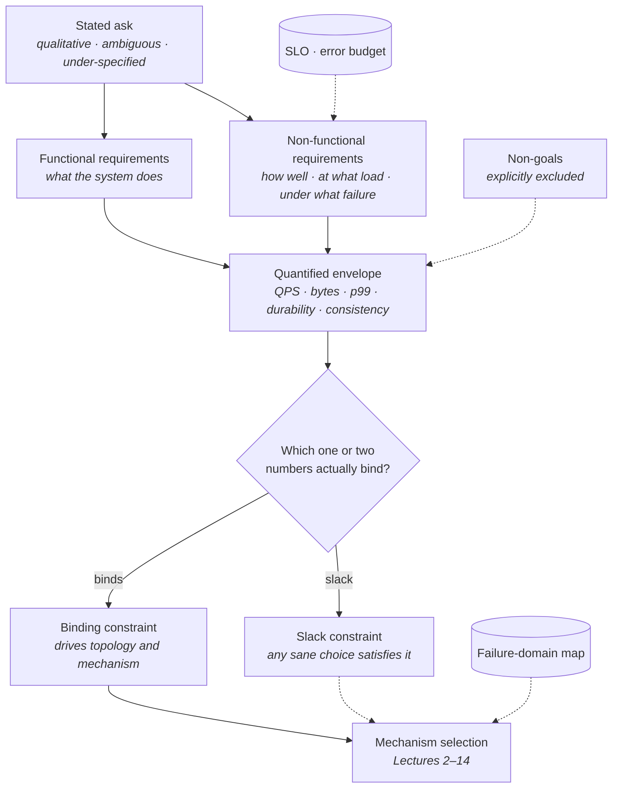
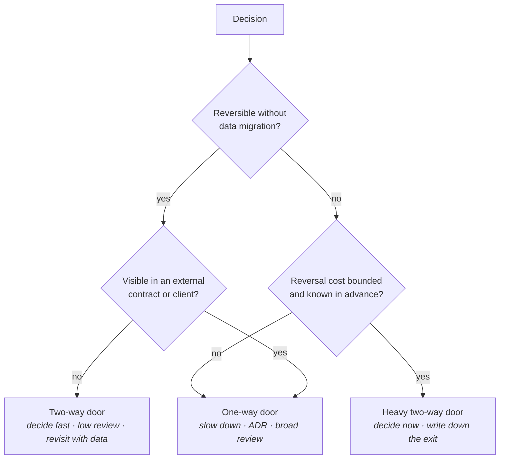
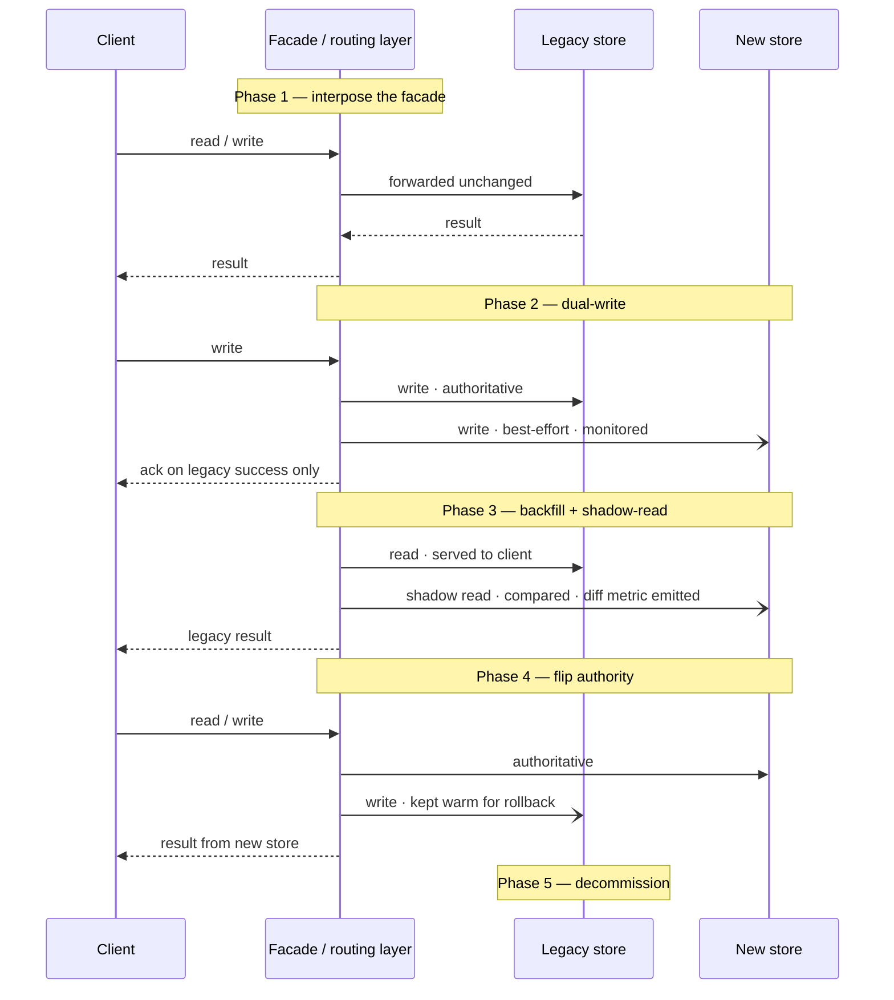
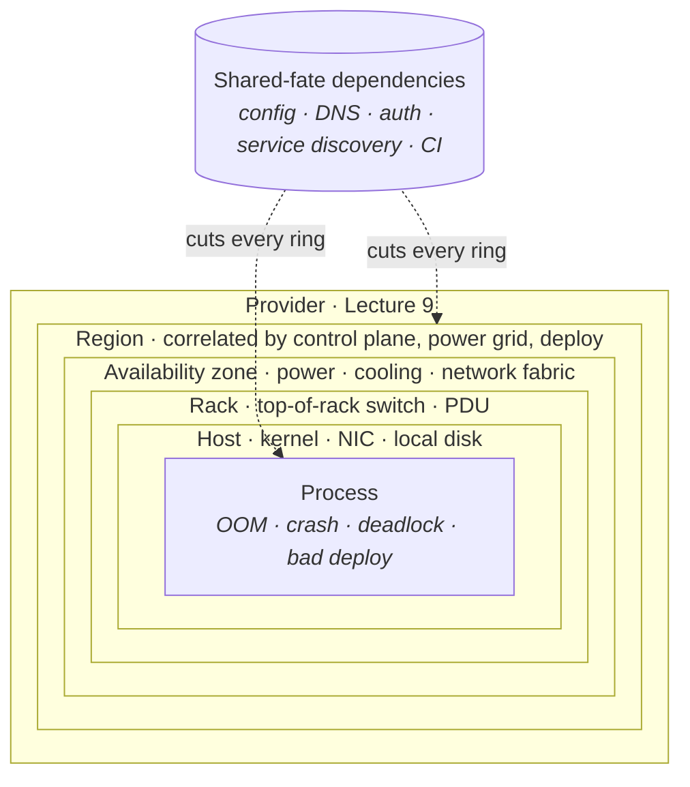
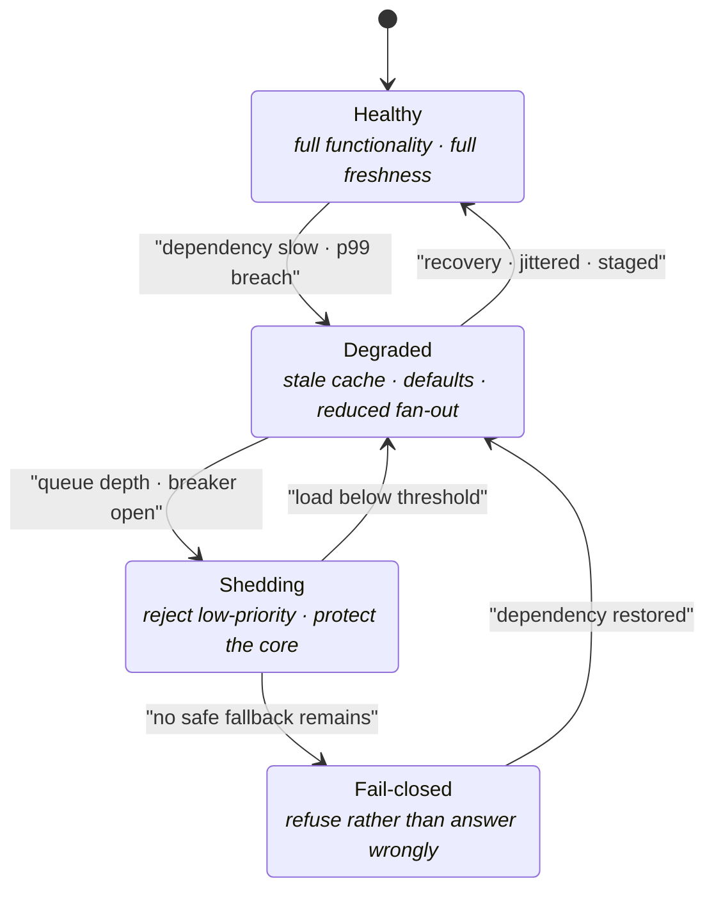

# Cross-Cutting Design Reasoning

Lectures 1–14 were the vocabulary. This lecture is the method — what separates a staff-level answer from a senior one is rarely a missing component, it is how constraints are framed, trade-offs are named, and failure is reasoned about before the happy path is drawn.

A senior engineer can name the right components and wire them correctly. A staff engineer does something different and more uncomfortable: they narrow the problem until only one or two numbers matter, they say out loud what each choice costs, they assume the design will be wrong and plan the migration off it, and they enumerate what breaks before they draw what works. None of that requires knowing a component you did not already know. It requires a set of habits, and habits are learnable. This chapter is those habits, plus the numbers you must be able to produce without thinking.

## The method, in one picture

Every design conversation runs the same pipeline. Most people start in the middle — at mechanism — and then reverse-justify. The move is to refuse to do that.

**How to read it:**

- **The solid path is the argument you speak aloud.** Ask → requirements → numbers → binding constraint → mechanism. If you cannot trace a mechanism back along that path, you chose it from habit, not from reasoning.
- **Non-goals attach to the envelope, not to the mechanism.** They shrink the problem *before* you size anything, which is the only point at which they save work.
- **The SLO is an input, not an output.** It is consulted when framing non-functional requirements and again when choosing mechanisms — this is the content of [§ Establish SLOs before choosing mechanisms](#establish-slos-before-choosing-mechanisms), and it is the single most commonly inverted arrow in the whole diagram.
- **The failure-domain map is drawn before mechanism selection**, not after. Dotted, because it constrains every box rather than sitting in the flow.
- **Most constraints have slack.** Naming which ones do is as valuable as naming which ones bind — it is how you justify the boring choice for everything that does not matter.

## Requirements and constraint framing

The most expensive mistakes are made in the first five minutes, before any component is named. This section is the highest-leverage part of the chapter.

### Functional versus non-functional requirements

- **Functional requirement** — a statement about *what the system does*. Testable by a single request: given this input, the system produces that output or effect.
- **Non-functional requirement** — a statement about *how well, at what scale, and under what conditions* it does it. Never testable by a single request; only by a distribution of requests over time.
- **Key distinction:** functional requirements determine the *components*; non-functional requirements determine the *topology*. Two systems with identical functional requirements and different latency and durability targets share almost no architecture.
- **The functional list should be short and boring.** In practice it collapses to a handful of operations — write a thing, read a thing, list things, subscribe to changes. Enumerate them explicitly and stop; the long tail of features rarely changes the design.
- **The non-functional list is where the design actually lives.** It has a fixed shape, and you should be able to produce it from memory:
  - **Load** — request rate, its shape over the day, its burst factor.
  - **Latency** — a percentile *and* a threshold. "Fast" is not a requirement; `p99 < 200 ms` is.
  - **Durability** — how many copies, surviving what correlated failure, with what acceptable data-loss window (RPO).
  - **Availability** — target nines, and recovery time (RTO). Distinct from durability: you can be unavailable and lose nothing.
  - **Consistency** — what a reader is guaranteed to see relative to a completed write. See Lecture 2 for the vocabulary; the point here is that it belongs on this list.
  - **Retention** — how long data must be kept and queryable, which usually dominates storage math more than write rate does.
  - **Cost envelope** — the constraint everyone forgets and the one that kills real designs.
- **The trap:** treating the non-functional list as a formality to be recited, then designing as though only load mattered. Durability and consistency requirements eliminate whole component classes; load usually only sizes them.

### Turning vague asks into numbers

Every ask arrives qualitative. The conversion to numbers is a mechanical procedure and you should perform it visibly.

**The five quantities, and how each is derived:**

- **QPS** — `DAU × actions per user per day ÷ 86,400` gives the average. Then apply a **peak-to-average multiplier**: `2–3×` for human diurnal traffic, `5–10×` for event-driven or scheduled spikes, higher for anything triggered by a push notification or a cron. Design to peak, bill for average.
- **Size** — `bytes per record × record count × replication factor × retention × overhead multiplier`. The last two terms are the ones that move the answer by an order of magnitude, and they are the two people skip. [§ Payload, row, and message sizes](#payload-row-and-message-sizes) and [§ Replication, retention, and overhead multipliers](#replication-retention-and-overhead-multipliers) give the constants.
- **Latency** — always a *pair*: percentile and threshold, per operation class. Reads and writes get separate budgets. Then decompose the budget across the call path — network, queue, service, store — because a `200 ms` p99 with three sequential hops is a much harder problem than one with a single hop, and the decomposition is what reveals that.
- **Durability** — expressed as replica count, failure domains those replicas span, and RPO. "Three replicas" means nothing until you say whether they span AZs; three copies in one rack is one failure domain wearing a costume.
- **Consistency** — expressed as the guarantee a client observes, not as the name of a protocol. "Read-your-writes for the author, bounded staleness of a few seconds for everyone else" is a requirement. "Eventually consistent" is an abdication.
- **Rule of thumb:** if you cannot state the requirement as a number with a unit, you have not finished framing it. `p99`, `MB/s`, `GB/day`, `RPO = 0`, `≤ 5 s staleness`.

**Estimation discipline:**

- **Round aggressively.** Use `10⁵ s` for a day (`86,400`), `3 × 10⁷ s` for a year. One significant figure is the right precision; two is false confidence.
- **Carry units through every step.** Most arithmetic errors in design discussion are unit errors — bits versus bytes, per-day versus per-second, compressed versus raw.
- **Sanity-check against a node.** Every derived number should immediately be compared to [§ Per-node capacities](#per-node-capacities). A figure that implies four hundred database nodes and a figure that implies one-tenth of a node are both design-determining, and you learn which you are in only by dividing.
- **State the assumption you are least sure of.** "I am assuming a `10:1` read/write ratio; if it is `1000:1` the caching story changes and nothing else does." That sentence is worth more than the estimate itself, because it shows you know which input the design is sensitive to.

### Explicit non-goals and scope boundaries

- **A non-goal is a design decision, not an omission.** Stating "this system does not provide cross-partition transactions" removes an entire coordination layer and should be said with the same weight as any component choice.
- **The categories worth explicitly excluding:**
  - **Operations you will not support** — no global secondary queries, no arbitrary historical replay, no multi-object atomicity.
  - **Scales you are not building for** — "correct up to `10×` current volume, and I will say what breaks past that" is stronger than pretending to design for unbounded growth.
  - **Failure classes you accept** — "a full-region loss means hours of unavailability, and that is within the SLO."
  - **Adjacent systems you are not replacing** — the boundary with whatever already exists.
- **Scope boundaries are interface statements.** Where scope ends, a contract begins — which is why [§ Ownership boundaries and interface contracts](#ownership-boundaries-and-interface-contracts) on ownership boundaries is the same topic viewed organizationally.
- **The failure mode:** silent scope expansion. Each unstated capability accretes a component, and a design with eleven boxes cannot be reasoned about or defended. Boxes are not free; each one is an on-call rotation.
- **In an interview:** stating non-goals early buys permission to keep the design small. Without them, every simplification looks like an oversight instead of a choice.

### Finding the one or two constraints that drive the design

- **Almost every system is dominated by one or two numbers.** The rest of the envelope is satisfied incidentally. Identifying which is the central analytical act of design.
- **How to find them — divide the requirement by the capability:**
  - Required write throughput ÷ what one node sustains → do you need partitioning at all?
  - Required dataset size ÷ RAM per node → is this a cache-fits or cache-misses system?
  - Latency budget ÷ number of sequential hops → is there room for a network round trip per hop, or must you collapse hops?
  - Fan-out width against tail amplification (Lecture 1) → is the p99 achievable at all, or does `1 − (1 − p)ⁿ` already exceed it?
- **The ratio that is closest to 1 is your binding constraint.** Ratios far below 1 are slack; ratios far above 1 tell you the design is infeasible as framed and the requirement must be renegotiated — which is itself a legitimate and senior answer.
- **Common binding constraints, in rough order of how often they actually bind:**
  - **Dataset size versus memory** — decides cache architecture and whether reads touch disk.
  - **Write throughput versus single-node commit rate** — decides partitioning.
  - **Latency budget versus geographic distance** — decides replication topology, and cannot be engineered around; the speed of light is in Lecture 1 for a reason.
  - **Consistency requirement versus availability during partition** — decides quorum design.
  - **Cost per request** — decides everything, last, and usually after the design is already built.
- **What to do instead of enumerating everything:** name the binding constraint out loud, design against it, and explicitly declare the rest satisfied. "Storage is the constraint here; QPS is comfortably one node's worth and I will not partition for it" is a complete and confident statement.
- **The trap:** designing against the constraint that is most *interesting* rather than the one that binds. Distributed consensus is more fun than retention math. Retention math is more often the answer.

## Trade-off articulation

A trade-off named is a trade-off understood. The single most reliable signal of level in a design discussion is whether the candidate volunteers costs or has to be asked for them.

### Naming the axis

- **Every choice sits on an axis, and the axis has a name.** Say the axis before you say the choice — it converts an opinion into an analysis.
- **The axes that recur across all fourteen previous lectures:**
  - **Latency versus consistency** — synchronous replication costs a round trip on every write; asynchronous costs a staleness window and an RPO. Lectures 2 and 11.
  - **Latency versus durability** — every `fsync` is latency purchased as safety. Group commit buys back throughput but not tail latency. Lectures 11 and 13.
  - **Cost versus reliability** — the third replica, the cross-region copy, the standby that idles. Reliability is bought in discrete, expensive units.
  - **Simplicity versus flexibility** — a schema, a fixed access pattern, and one storage engine are simple and constraining. Generic layers are flexible and unreasonable to operate.
  - **Throughput versus tail latency** — batching, queueing, and high utilization all raise throughput and degrade the tail. The M/M/1 knee in Lecture 1 is the formal statement.
  - **Read amplification versus write amplification versus space amplification** — the RUM conjecture; you may optimize two. Lecture 4.
  - **Coupling versus autonomy** — synchronous calls give correctness and shared fate; events give autonomy and eventual consistency. Lectures 6 and 7.
  - **Freshness versus cost** — cache TTLs, materialized views, and batch pipelines are all the same trade wearing different clothes. Lecture 5.
- **Rule of thumb:** if you cannot name the axis, you are not making a trade-off, you are expressing a preference.

### Stating what you give up

- **The formula:** *"I am choosing X. It buys me A. It costs me B. I am accepting B because C."* Four clauses. Most answers contain only the first two.
- **Costs come in categories, and the unfamiliar ones are the ones worth naming:**
  - **Correctness cost** — what guarantee weakens. Which anomalies become observable.
  - **Latency cost** — which percentile moves, and on which operation.
  - **Cost cost** — infrastructure spend, in a unit like cost-per-request or dollars-per-TB-month.
  - **Operational cost** — new failure modes, new alerts, new runbooks, new on-call knowledge. See [§ Operational burden as a design cost](#operational-burden-as-a-design-cost); this is the cost most consistently under-counted.
  - **Cognitive cost** — one more thing every engineer touching the system must understand, forever.
- **The failure mode:** the *free lunch answer*, in which every component is added and nothing is given up. It reads as inexperience, because every real system is a pile of accepted costs.
- **Honest examples of costs that get elided:** a cache adds an invalidation correctness problem and a cold-start cliff; a queue converts a synchronous failure into an unbounded backlog and reordering; a read replica adds a staleness window your application must be written to tolerate; sharding forfeits cross-shard transactions and joins; a CDC pipeline makes your database schema a public interface.
- **In an interview:** volunteer the cost before you are asked. Being asked "what are the downsides?" means you left the most valuable half of the answer on the table.

### Reversibility: one-way versus two-way doors

The decisive question about a decision is usually not whether it is correct but whether being wrong is survivable.

**How to use the test:**

- **Two-way doors deserve speed, not consensus.** Cache eviction policy, connection pool sizing, retry budgets, index choice, instance types, most internal library choices. Getting these wrong costs a deploy.
- **One-way doors deserve disproportionate care.** They share three traits: they migrate data, they are visible externally, or their reversal cost is unknown — which is the worst case, because unbounded cost cannot be budgeted against.
- **The canonical one-way doors:**
  - **Public API shape and semantics** — every external consumer becomes a constraint the moment they integrate.
  - **Partition key and shard scheme** — reversing means rewriting the entire dataset while serving traffic.
  - **Event schema on a durable log** — historical events are immutable; a schema mistake is permanent in the archive. Lecture 13.
  - **Data model in a store without cheap online DDL** — the cost of a type change is the size of the table.
  - **Identifier scheme** — identifiers leak into every downstream system, every log, every customer's database.
  - **The consistency guarantee you advertise** — clients will build on the strongest behavior they observe, not the weakest one you documented.
- **Key distinction:** reversibility is a property of the *blast radius*, not of the code. Deleting a service is easy; un-publishing the identifiers it minted is not.
- **The trap:** treating everything as a one-way door. That is how design review becomes a six-week ritual for a config change. Classify explicitly, then apply proportional process.
- **What to do instead of agonizing:** for anything close to the line, make the decision *and* write down the exit — what would have to be true to revert, and roughly what it would cost. A documented exit converts a scary decision into a bounded one.

### Choosing boring technology

- **The claim:** a small number of well-understood components, used unimaginatively, beats a well-matched exotic component in almost every real organization. This is not conservatism; it is an argument about where your failure budget goes.
- **What "boring" actually means:** the failure modes are known to you, the operational playbook exists, the hiring pool understands it, and the debugging tools are ones you have used at 3 a.m. Boring is a property of your organization's relationship with a technology, not of the technology.
- **The innovation-token framing:** an organization can absorb only a few genuinely novel technologies at once. Spend the tokens where the novelty is load-bearing for the product, and take the default everywhere else.
- **Where the boring answer is genuinely right and under-used:**
  - **PostgreSQL as a queue, a job store, a cache, a document store, and a search index** — up to volumes far higher than most people assume. Lecture 12 gives the actual limits; [§ Per-node capacities](#per-node-capacities) gives the numbers.
  - **A single large node** before any partitioning, because modern nodes are enormous and partitioning forfeits transactions.
  - **A managed service** before a self-hosted cluster, because the operational cost is the real cost. [§ Build versus buy versus managed service](#build-versus-buy-versus-managed-service).
  - **Polling before streaming**, when the poll interval satisfies the freshness requirement — it removes an entire class of delivery and ordering problems.
- **Its genuine costs, stated honestly:**
  - A boring component used past its envelope fails badly rather than gracefully — the Postgres-as-queue pattern is excellent until it is a vacuum crisis.
  - You pay in efficiency: the specialized system is genuinely faster at its specialty, sometimes by an order of magnitude.
  - You may accumulate a slow migration debt, arriving at the specialized system later and under duress rather than early and calmly.
- **Rule of thumb:** justify the boring choice with a number — the node capacity that shows it fits — and name the threshold at which you would move. "This fits one Postgres instance until roughly `X` writes per second; past that I would move the hot path to a log." That single sentence demonstrates both the boring judgment and the knowledge of the alternative.
- **The trap:** presenting boring as a personality trait rather than an analysis. The boring choice is only defensible if you can show it clears the constraint from [§ Finding the one or two constraints that drive the design](#finding-the-one-or-two-constraints-that-drive-the-design).

## Evolution and migration thinking

Systems are never built; they are migrated. A design that cannot describe its own succession is a design that assumes it is correct, which no design is.

### Design for the next 10×, not the final 1000×

- **The claim:** architect for roughly one order of magnitude of growth beyond current load, and explicitly state what breaks at the next order.
- **Why not more:** designing for `1000×` means paying the coordination, operational, and cognitive cost of that scale today, against a requirement that is a guess. Most such systems die of complexity before reaching the load they were built for.
- **Why not less:** rebuilding every `2×` is a treadmill, and each rebuild is a migration with its own risk budget.
- **What "designing for 10×" concretely means:**
  - The data model does not have to change — the partition key, the identifier scheme, and the event schema all still work. These are the one-way doors from [§ Reversibility: one-way versus two-way doors](#reversibility-one-way-versus-two-way-doors), so they are the parts that must be future-proofed.
  - The scaling move is *known and pre-described*, even if unexecuted — "this is single-node now; the partition key is already in the schema and the shard-routing layer is the change."
  - Capacity headroom exists in the reversible dimensions: instance size, replica count, cache size. Two-way doors absorb growth cheaply.
- **The most valuable sentence in any design review:** "here is what breaks first as this grows, and here is the number at which it breaks." It converts an architecture into a roadmap.
- **The trap:** conflating "supports 10× growth" with "10× the hardware." Some things scale linearly with hardware; coordination, fan-out, and anything with `O(n²)` communication do not. Lecture 1's Universal Scalability Law is the formal warning.

### Incremental migration paths

No meaningful migration is a cutover. Every safe migration is the same five-phase sequence, and knowing it by heart is a staff-level marker.

**What each phase buys, and what it costs:**

- **Phase 1 — the facade (strangler fig).** Interpose a routing layer that owns the decision of where a request goes. It changes no behavior and is therefore boring to ship, which is exactly the point: it converts every later phase into a config change instead of a code change. The cost is a hop of latency and a new component that must be highly available.
- **Phase 2 — dual-write.** Writes go to both stores; the legacy store remains authoritative and alone determines the client's acknowledgement. **The unavoidable flaw:** dual-write is not atomic. Two stores, two failures, no transaction. You *will* diverge, so you must plan for reconciliation rather than pretend to prevent it. The alternatives are to drive the second write from the legacy store's change log (CDC), which makes it a single write plus asynchronous propagation, or to accept the divergence and repair it in Phase 3.
- **Phase 3 — backfill and shadow-read.** Historical data is backfilled while both stores take live writes; reads are served from legacy and *also* issued to the new store, with results compared and differences emitted as a metric. Shadow reads are the cheapest correctness evidence in existence: real traffic, real distributions, zero user risk. The cost is doubled read load and the discipline to actually drive the diff rate to zero rather than to "low."
- **Phase 4 — flip authority.** Move the authoritative role to the new store, usually per-tenant or per-key-range rather than globally, and keep writing to the legacy store so rollback stays available. **The rollback window is the whole point of this phase** — a flip you cannot undo is a one-way door, and [§ Reversibility: one-way versus two-way doors](#reversibility-one-way-versus-two-way-doors) says to treat it accordingly.
- **Phase 5 — decommission.** [§ Decommissioning as part of the design](#decommissioning-as-part-of-the-design).
- **Key distinction:** *strangler fig* is the overall shape (route incrementally, shrink the legacy surface); *dual-write* and *shadow-read* are the specific techniques for writes and reads within it. They are not alternatives to one another.
- **Rule of thumb:** every phase must be independently revertible, and every phase must emit a metric that tells you whether it is safe to proceed. A migration without a diff rate is a migration performed with eyes closed.

### Backfill strategy and consistency during migration

- **Backfill is a batch job that races live traffic**, and the race is the entire problem.
- **The ordering constraint:** start dual-writing *before* backfilling. If you backfill first, every write occurring during the backfill is lost from the new store and you cannot tell which. Dual-write first means the backfill's only job is history, which is static.
- **Backfill must be idempotent and resumable.** Write it as an upsert keyed by the record identity, checkpointed by a scannable cursor (identifier range or timestamp), so a failure at 80% resumes rather than restarts.
- **Backfill must not overwrite newer live data.** The two workable strategies:
  - **Conditional write** — insert only if absent, or update only if the source version is newer than what is present. Requires a version or updated-at column that is genuinely monotonic.
  - **Backfill-then-repair** — allow the race, then run a reconciliation pass that compares and fixes. Simpler to write, requires a comparison job you will need anyway.
- **Throttle the backfill against the *source*, not the destination.** The classic migration incident is a backfill scan saturating the legacy database's buffer cache and degrading production reads. Rate-limit it, run it against a replica where possible, and give it a kill switch that a person under stress can find.
- **Consistency during migration is weaker than before or after it.** Be explicit about which anomalies are live during the window and for how long:
  - Reads may observe the two stores disagreeing if any read path is split.
  - A record written just before a flip may be absent from the new store for the propagation delay.
  - Deletes are the sharpest edge: a delete that reaches only one store resurrects the record when the other backfills over it. **Tombstones, not deletions, during migration.**
- **The reconciliation job is not optional.** Continuous comparison of a sampled key range with a divergence metric is what turns "we believe it is consistent" into evidence. Keep it running after the flip; it is also your rollback confidence.
- **The failure mode:** treating a diff rate of `0.01%` as done. At `10⁹` records that is `10⁵` wrong records, and the wrong ones are never randomly distributed — they cluster on exactly the edge cases that generated them.

### Decommissioning as part of the design

- **A migration is not complete when the new system serves traffic; it is complete when the old system is deleted.** Everything between those two points is the most expensive state a system can be in: two systems, two failure modes, two on-call burdens, and one team's attention.
- **Why decommissioning is skipped:** it is invisible work with no feature attached, it is the phase after the risky part has been survived, and the legacy system is by then perfectly stable. Stability is the argument *for* deletion — a stable system nobody touches is a system nobody remembers how to operate when it finally fails.
- **What a decommission plan contains, and it must exist at design time:**
  - **The list of consumers**, and how you will *prove* it is complete — access logs, audit trails, and network policy, not a survey. Someone always has a script.
  - **The dark period** — the legacy system is switched off but not deleted, for at least one full business cycle (a month covers monthly reporting). Anything that screams, screams during this window while recovery is still a restart.
  - **Data disposition** — what is archived, in what format, readable by what, and for how long. Retention and regulatory obligations outlive services.
  - **The rollback expiry** — the explicit date after which rollback is no longer supported, so dual-write can stop. Until that date you are paying for two systems; the date is what makes the cost finite.
- **In an interview:** volunteering "and here is how the old path gets deleted" is unusual enough to be a differentiator, because it demonstrates you have finished a migration rather than only started one.
- **Rule of thumb:** if the design does not name what it replaces and how that thing dies, it is a design for an addition, not a change — and additions are how systems become unownable.

## Organizational and lifecycle dimensions

The architecture you can operate is a function of the organization you have. Ignoring that is not purity; it is a design error with a delivery date.

### Build versus buy versus managed service

- **Three options, not two.** The middle option — run open-source software yourself — is the one people forget to distinguish from building, and it has the cost profile of building with none of the differentiation.
- **The comparison that matters:**
  - **Build** — total control, exact fit, and *you own every failure mode forever*. Justified only when the component is the product's differentiator.
  - **Self-host open source** — no license cost, full control of version and configuration, and you have hired an operations team whether or not you know it. Upgrades, capacity, backups, and 3 a.m. recovery are yours.
  - **Managed service** — you rent the operations. You pay a multiple on raw infrastructure, you accept the provider's version, limits, and failure modes, and you give up some debuggability at the exact moment you most want it.
- **How to decide — three questions:**
  - **Is this component a differentiator?** If a customer would never notice it being best-in-class, do not build it.
  - **What is the fully-loaded operational cost?** Convert to engineer-months per year, then to money. A managed service at `3×` the infrastructure price is cheap against half an engineer.
  - **What is the exit?** Managed services vary enormously in lock-in. A managed Postgres speaks Postgres; a proprietary API with no equivalent elsewhere is a one-way door in the sense of [§ Reversibility: one-way versus two-way doors](#reversibility-one-way-versus-two-way-doors), and should be priced as one.
- **The trap:** comparing the license or hosting bill and calling it a cost analysis. The bill is the smallest term.
- **Rule of thumb:** buy or rent everything that is not the thing you are differentiating on, and spend the saved attention on the part that is.

### Operational burden as a design cost

- **The claim:** operational burden is a first-class design cost and should be weighed in the same sentence as latency and money. A design that is `20%` faster and doubles the on-call load is usually the worse design.
- **What operational burden is actually made of:**
  - **Failure modes** — every component adds its own, and interactions add more than the components do.
  - **Alerts and their false-positive rate** — an alert that pages spuriously is worse than no alert, because it trains people to ignore the class.
  - **Runbooks and the knowledge to use them** — knowledge decays; a procedure not exercised in six months does not exist.
  - **Upgrades** — every stateful system has a version treadmill with its own migration risk.
  - **Capacity management** — someone must notice the disk filling before it fills.
  - **Backup and, more importantly, restore** — an untested restore is not a backup. The restore *time* is a design parameter, since it is your RTO.
- **Stateless components are dramatically cheaper to operate than stateful ones.** This asymmetry should shape topology: push state into a small number of well-understood stores and keep everything else disposable. The single best operational decision available in most designs is *fewer stateful systems*.
- **Rule of thumb:** count the stateful systems in your design. Each one is roughly a permanent fraction of an engineer. If the count is above three or four for a single team, the design is over budget regardless of what it costs to run.
- **The failure mode:** the design that is correct and unoperatable — technically optimal, requiring expertise the team does not have, on a component nobody has debugged under load. It will be replaced by something worse and simpler, at a cost.

### Ownership boundaries and interface contracts

- **Systems inherit the shape of the organizations that build them** — Conway's Law, which is descriptive rather than aspirational. You may design against it, but you will be paying a continuous tax to do so.
- **The practical consequence:** a service boundary that cuts across a team boundary produces a component with two owners, which reliably means none. Draw boundaries where the ownership can actually sit.
- **What a boundary must define, or it is not a boundary:**
  - **The interface contract** — operations, schema, and error semantics.
  - **The guarantees** — latency percentiles, availability, consistency, and ordering. A contract without a latency guarantee is a contract that will be called synchronously in a hot path.
  - **Compatibility rules** — what may change without coordination, what requires versioning, what requires a deprecation cycle with a date.
  - **The escalation path** — who is paged when it misbehaves, and who decides when consumers disagree.
- **Data is the boundary people forget.** Two services sharing a database table share a deployment schedule, a failure mode, and a schema-migration veto, whatever the org chart says. **Shared mutable storage is the strongest coupling there is** — stronger than a synchronous RPC, because it is invisible in the call graph.
- **The trap:** modeling boundaries after the domain diagram while the data access pattern crosses them freely. The real boundary is wherever the writes are.
- **Key distinction:** an internal interface is cheap to change if you can find all callers; an external one cannot be changed at all. This is the same one-way-door test from [§ Reversibility: one-way versus two-way doors](#reversibility-one-way-versus-two-way-doors) applied to interfaces, and it is why publishing an API is a bigger decision than building one.

### Documentation, ADRs, and design review

- **The artifact that matters is the one that records *why*.** Code shows what the system does. Diagrams show its shape. Neither survives the question that actually recurs — "why is it like this?" — which is asked most often by the person considering changing it.
- **An architecture decision record (ADR) is short and has a fixed shape:**
  - **Context** — the constraints in force at the time, including the numbers.
  - **Decision** — what was chosen, stated in one sentence.
  - **Alternatives considered** — and specifically why each was rejected. This is the section future readers actually need, because they will re-propose the rejected options.
  - **Consequences** — what this costs, per [§ Stating what you give up](#stating-what-you-give-up), including what it makes harder later.
  - **Status** — proposed, accepted, superseded-by. ADRs are immutable and append-only; you supersede, you do not edit. An edited record loses the thing that made it valuable, which is that it captured a moment's constraints.
- **Why immutability matters:** the value of an ADR is that it dates the reasoning. "We chose this when we had `10 GB` and one team" explains a decision that looks wrong at `10 TB` and eight teams — and tells you exactly what changed.
- **Design review is a mechanism for finding the constraint you did not frame**, not an approval gate. The reviewers who help are the ones who have operated something similar, and their most valuable output is a failure mode you had not enumerated.
- **What to bring to a review:** the numbers from [§ Turning vague asks into numbers](#turning-vague-asks-into-numbers), the binding constraint from [§ Finding the one or two constraints that drive the design](#finding-the-one-or-two-constraints-that-drive-the-design), the trade-offs from [§ Stating what you give up](#stating-what-you-give-up) already stated as costs, and the failure enumeration from [§ The failure-first design habit](#the-failure-first-design-habit). Bringing a diagram alone converts the review into requirements-gathering conducted by an audience.
- **Rule of thumb:** apply review proportional to the door. One-way doors get an ADR and broad review; two-way doors get a pull request and a decision. Reviewing everything equally is how organizations make one-way doors casually while ceremonially debating cache TTLs.

## The failure-first design habit

This is the habit that changes design conversations the most and is the least commonly practised. **Enumerate failure before drawing the happy path**, because the happy path is the easy part and it constrains almost nothing.

### The three questions for every dependency

For each dependency, ask three questions in order. They have different answers and the third is the hard one.

- **What happens when it is *down*?** The easy case, because it is unambiguous: connections refused, errors returned, failure fast and detectable. The design question is only what you do instead — fail, degrade, or serve stale.
- **What happens when it is *slow*?** Much worse than down. Slow dependencies consume your threads, connections, and memory while producing nothing; your service fails from resource exhaustion rather than from the dependency's error. **A timeout is not a nicety, it is the mechanism that converts "slow" into "down"** so the down-case handling can run. Every call needs one, and it should be derived from the latency budget rather than picked as a round number.
- **What happens when it is *half-down*?** The genuinely hard case, and the shape of most real incidents. One shard is unavailable while the others serve; one AZ's replicas are stale; the service returns success for reads and silently drops writes; latency is fine at p50 and catastrophic at p99. Health checks pass. Failover does not trigger. This is **gray failure**, and it is why "is it up?" is the wrong monitoring question and "is it serving correctly, for whom?" is the right one.
- **The follow-on question that is never asked:** what happens when it *comes back*? Recovery is a load event. Every client retries at once, every cache is cold, every queue drains simultaneously. Systems that survive the outage frequently die in the recovery — the *thundering herd*, addressed by jittered backoff, staged re-entry, and request-collapsing at the cache (Lecture 5).
- **Rule of thumb:** for every arrow on your diagram, you owe three answers plus the recovery one. If you cannot give them, the arrow is a hope rather than a design.

### Enumerating failure domains before the happy path

A failure domain is a set of components that fail together. The design question is never "does this fail?" but "what else fails when it does?"

**What the picture is for:**

- **Replicas only help if they sit in different rings.** Three replicas on one host survive a process crash and nothing else. The question to ask of every redundancy claim is *which ring does it span* — this is the whole content of [§ Turning vague asks into numbers](#turning-vague-asks-into-numbers)'s point that "three replicas" is meaningless without failure domains.
- **Cost rises sharply with each ring outward**, because latency does. Cross-AZ replication costs a millisecond and cross-AZ transfer fees; cross-region replication costs tens of milliseconds and forces the synchronous-versus-asynchronous decision from [§ Naming the axis](#naming-the-axis).
- **The dotted line is where real outages come from.** Configuration, DNS, certificate expiry, service discovery, authentication, and the deployment pipeline are shared by every ring simultaneously. Physical redundancy provides no protection against a bad config pushed everywhere — which is why staged rollout is a *reliability* mechanism, not a release convenience.
- **The largest correlated failure domain in most systems is the deploy.** It reaches every instance in every zone within minutes, by design.
- **Correlation is also induced by *shared behavior*, not only shared hardware** — identical retry logic, identical cache expiry times, identical cron schedules. Synchronized clients are a failure domain that does not appear on any topology diagram. Jitter everything.
- **The move:** enumerate rings, ask what the system does when each is lost, *then* draw the happy path. Doing it in this order routinely eliminates components — you discover that a piece of redundancy protects against nothing that actually happens.

### Defining degradation behavior per component

Degradation is a design output, decided in advance and per component. Left undecided, the default degradation is "everything returns a 500," which is a choice made by accident.

**How to assign a degradation mode:**

- **The ladder is ordered by how much correctness you are willing to trade for availability**, and the position on it is a product decision as much as an engineering one. Make someone say which rung is acceptable.
- **Serve-stale** — the cache answers past its TTL when the origin is unavailable. Correct for anything where freshness is a preference rather than a guarantee: recommendations, counts, feeds, configuration. Requires the cache to keep entries past expiry deliberately.
- **Serve-default** — a static or computed fallback replaces a personalized answer. Cheap, and it preserves the page rather than the feature.
- **Reduced fan-out** — drop the optional enrichments and return the core object. This is the single highest-leverage degradation in fan-out-heavy read paths, because it directly attacks the tail amplification of Lecture 1.
- **Shed load** — reject a fraction of requests deliberately, by priority, to keep the rest within SLO. **A bounded queue with rejection is a feature; an unbounded queue is a latency bug that has not surfaced yet.** Shed the cheapest, least valuable traffic first, and make sure health checks and control-plane traffic are exempt.
- **Fail-closed** — refuse to answer rather than answer wrongly. Mandatory wherever a wrong answer is worse than no answer: authorization, payments, anything with a compliance boundary. **Key distinction:** fail-open and fail-closed are opposite correct answers depending on whether the component is a *safety* control or an *availability* control, and choosing the wrong default is how a cache outage becomes a security incident.
- **The essential rule:** degradation must be *decided per component*, not globally. In any real design some components degrade to stale, some to defaults, and one or two must fail closed. A design that answers this question uniformly has not answered it.
- **Degradation must be exercised.** A fallback path that has never run in production does not work; assume this. Game days, fault injection, and forcing the breaker open in a canary are the only evidence that counts.

### Establish SLOs before choosing mechanisms

- **An SLO is a requirement statement**: a percentile-and-threshold target over a window, plus the error budget its complement defines. It belongs in [§ Functional versus non-functional requirements](#functional-versus-non-functional-requirements)'s non-functional list and it precedes every mechanism decision.
- **Why the ordering is non-negotiable:** the SLO is what makes a mechanism justifiable or excessive. Cross-region synchronous replication is either necessary or absurd depending entirely on the availability target, and no amount of architecture discussion resolves that without the number.
- **The error budget converts reliability into a currency.** A `99.9%` monthly target is roughly `43 minutes` of budget; `99.99%` is roughly `4.3 minutes`. Every planned migration, deploy, and maintenance window spends from it — which is what makes it a real constraint on velocity rather than an aspiration.
- **Availability composes multiplicatively across serial dependencies.** Five dependencies at `99.9%` each, all required, yield about `99.5%` — worse than any component. This arithmetic (Lecture 1) is the strongest available argument for *fewer components in the critical path*, and for converting hard dependencies into soft ones via the degradation modes in [§ Defining degradation behavior per component](#defining-degradation-behavior-per-component).
- **Set the SLO from what the consumer actually needs, not from what you currently achieve.** An SLO that merely records current behavior cannot inform a decision. And an SLO set higher than needed is expensive in exactly the way [§ Operational burden as a design cost](#operational-burden-as-a-design-cost) describes, permanently.
- **Measure it where the client experiences it.** Server-side latency excludes queueing, connection setup, and the retry the client performed — which is to say it excludes most of what the user felt.
- **The trap:** picking mechanisms first and then reverse-fitting an SLO that the design happens to meet. This is the single most common inversion in design discussion, and it makes the entire argument unfalsifiable.

## Numeric fluency to have memorized

This is the memorize-this page. These figures are order-of-magnitude, not benchmarks — the point is to divide two of them in your head and immediately know whether a design is one node or three hundred. Treat every number as "within a factor of two or three, on commodity hardware."

### Latency, and what each tier forbids

| Operation | Time | Relative |
|---|---|---|
| L1 cache reference | `1 ns` | 1× |
| Branch mispredict | `3 ns` | 3× |
| L2 cache reference | `4 ns` | 4× |
| Mutex lock/unlock, uncontended | `20 ns` | 20× |
| L3 cache reference | `20–30 ns` | 25× |
| Main memory (DRAM) reference | `100 ns` | 100× |
| Compress 1 KB (zstd/snappy, fast level) | `1–3 µs` | 10³× |
| Send 1 KB over 10 Gbps NIC | `~1 µs` | 10³× |
| NVMe SSD random read, 4 KB | `50–150 µs` | 10⁵× |
| Read 1 MB sequentially from NVMe | `100–300 µs` | 10⁵× |
| Read 1 MB sequentially from DRAM | `20–50 µs` | 10⁴× |
| Round trip within the same rack / AZ | `0.25–0.5 ms` | 10⁵–10⁶× |
| Round trip cross-AZ, same region | `0.5–2 ms` | 10⁶× |
| HDD seek | `5–10 ms` | 10⁷× |
| Round trip cross-region, same continent | `30–80 ms` | 10⁷× |
| Round trip trans-Atlantic (US-East ↔ EU-West) | `70–90 ms` | 10⁸× |
| Round trip trans-Pacific (US-West ↔ Asia) | `120–200 ms` | 10⁸× |
| TCP + TLS 1.3 handshake | `2 RTT` (1 with resumption) | — |

**What each tier forbids:**

- **The three anchors to actually memorize:** DRAM `100 ns`, NVMe `100 µs`, same-AZ round trip `500 µs`, cross-continent round trip `100 ms`. Everything else can be reconstructed by interpolation. Note that a network round trip inside a datacenter costs about the same as an SSD read — which is why a remote cache beats a local disk.
- **Speed of light is the hard floor.** Light in fiber travels about `200,000 km/s`, giving roughly `10 µs` of round trip per kilometre of path, and real paths are `1.5–2×` the great-circle distance. New York to London is `5,600 km`, so `~56 ms` is the theoretical round-trip floor and `70–90 ms` is reality. **No engineering removes this.** A design requiring synchronous cross-continent agreement per request has a p99 floor of `100 ms+` and no amount of optimization changes it — the only fix is to move the data or drop the synchrony.
- **Sub-millisecond budgets forbid a network hop with a disk read behind it.** They imply in-memory, same-AZ, single hop.
- **A `10 ms` budget allows a handful of same-region round trips**, one of which may hit disk. This is the ordinary regime for a well-built API backend.
- **A `100 ms` budget allows one cross-continent round trip and nothing else** — or several regional round trips. Choose.
- **Sequential is `10–100×` cheaper than random, on every storage medium including memory.** This single fact generates B-trees, LSM trees, log-structured everything, and columnar layouts.
- **Tail amplification:** with fan-out `n` to independent services each with tail probability `p`, the chance a request hits at least one slow component is `1 − (1 − p)ⁿ`. At `p = 1%` and `n = 100`, that is `63%`. A p99-clean fleet produces a p50-ugly fan-out. Hedge, or reduce the fan-out.

### Per-node capacities

Assume a commodity node: `16 vCPU`, `64 GB` RAM, local NVMe, `10 Gbps` NIC. These are *sustainable* figures, not benchmark peaks; plan at `50–70%` of them.

| System | Quantity | Figure |
|---|---|---|
| **PostgreSQL** | Point reads from cache | `10k–50k` QPS |
| | Point reads hitting disk | `2k–10k` QPS |
| | Simple write transactions | `2k–10k` TPS |
| | Concurrent *active* backends before contention | `2–4 ×` core count (`~30–60`) |
| | Client connections (requires a pooler beyond this) | `~200–500` |
| | Comfortable dataset per instance | `1–10 TB` |
| | Table size before partitioning is advisable | `~100–500 GB` |
| | Replication lag, async, healthy | `< 100 ms` |
| **Redis** | GET/SET, no pipelining, one core | `80k–150k` ops/s |
| | GET/SET, pipelined or multi-instance | `0.5M–1M+` ops/s |
| | p99 latency, well-sized | `< 1 ms` |
| | Usable dataset per node | `~60–70%` of RAM |
| | Practical dataset ceiling (fork/persistence pain above) | `25–100 GB` |
| **Kafka** | Sustained throughput per broker | `100 MB/s – 1 GB/s` |
| | Messages/s per broker (`~1 KB` messages) | `100k–1M` |
| | Throughput per partition, planning figure | `~10 MB/s` |
| | Partitions per broker, healthy | `1k–4k` |
| | Producer end-to-end latency, `acks=all` | `5–20 ms` |
| | Consumer lag when healthy | `< 1 s` |
| **App server** | Trivial JSON echo, Go/Java | `20k–50k` RPS |
| | Real handler, 1–3 downstream calls | `1k–5k` RPS |
| | CPU-bound handler (serialization, crypto, template) | `200–2k` RPS |
| | Concurrent in-flight requests (Little's Law, `L = λW`) | `RPS × latency` |
| **Node primitives** | NVMe random IOPS | `100k–1M` |
| | NVMe sequential throughput | `2–7 GB/s` |
| | NIC at `10 Gbps` | `~1.25 GB/s` |
| | Memory bandwidth | `20–100 GB/s` |

**How to use this table:**

- **Divide, then decide.** Required throughput ÷ per-node figure is the node count and therefore the architecture. A result under 1 means you are having a single-node conversation and should say so; a result over ~50 means the constraint is real and partitioning is not optional.
- **Little's Law is the most useful formula on this page.** `L = λW`: concurrency equals arrival rate times latency. `2,000 RPS` at `50 ms` means `100` requests in flight — which sizes your thread pool, your connection pool, and your memory. It also tells you that a latency increase *raises concurrency*, which is why a slow dependency exhausts resources ([§ The three questions for every dependency](#the-three-questions-for-every-dependency)).
- **Postgres connections are the most commonly-violated limit here.** Each connection is a process with its own memory; hundreds of idle connections cost real RAM and contention. Pool aggressively — this is the practical content of Lecture 12.
- **Redis is single-threaded per instance for command execution**, so its per-node number is a per-*core* number, and a single slow command (`KEYS`, a large `ZRANGE`, an `O(n)` operation) blocks everything. Its capacity is bounded by RAM and by the absence of long commands, not by CPU.
- **Kafka's partition count is a design parameter with a hard consequence:** it is the maximum consumer parallelism and the unit of ordering. Too few caps throughput; too many degrade the broker and lengthen leader elections.
- **These numbers are large.** The most common outcome of doing this arithmetic honestly is discovering the system fits on one node with a replica — which is exactly the evidence [§ Choosing boring technology](#choosing-boring-technology) requires to justify the boring choice.

### Payload, row, and message sizes

| Item | Size |
|---|---|
| `int8` / `bigint` / `timestamp` | `8 B` |
| UUID, binary / as text | `16 B` / `36 B` |
| PostgreSQL per-row overhead (tuple header + alignment) | `~24–28 B` |
| PostgreSQL page | `8 KB` |
| B-tree index entry (key + pointer + overhead) | `key + ~16 B` |
| Typical narrow relational row (a few ints, a short string) | `50–100 B` |
| Typical wide row with text fields | `500 B – 2 KB` |
| Chat / event / audit record | `100–500 B` |
| Structured log line | `200 B – 1 KB` |
| Kafka message, typical application event | `0.5–5 KB` |
| JSON API response, single object | `1–10 KB` |
| JSON API response, list page | `10–100 KB` |
| HTTP header block | `0.5–2 KB` |
| Redis key overhead (object + dict entry, small value) | `~50–100 B` per key |
| Thumbnail image | `10–50 KB` |
| Web image, full size | `200 KB – 2 MB` |
| Full modern web page, all assets | `2–5 MB` |
| Audio, compressed | `128 kbps ≈ 1 MB/min` |
| Video, 1080p | `~5 Mbps ≈ 2.2 GB/hour` |
| Video, 4K | `~25 Mbps ≈ 11 GB/hour` |

**Storage math, done in the right order:**

- **The formula:** `rows/day × bytes/row × retention_days × replication × overhead ÷ compression`. Perform it in exactly that order and carry the units; every term is a multiplier and skipping one costs an order of magnitude.
- **The overhead terms are not rounding errors.** For a `100 B` logical record in a relational store, row overhead plus indexes plus free-space headroom routinely lands you at `250–400 B` on disk. Estimate `2.5–4×` for narrow rows and `1.2–1.5×` for wide ones — **overhead is proportionally worst for the smallest rows**, which is why the "just store one row per event" designs blow their storage budget.
- **Anchor conversions worth memorizing:** `1 KB/s ≈ 86 MB/day ≈ 31 GB/year`. `1 MB/s ≈ 86 GB/day ≈ 31 TB/year`. `1,000 rows/s × 1 KB ≈ 86 GB/day`. Almost every capacity estimate is one of these scaled.
- **Bandwidth follows directly:** `payload × QPS`. `10,000 QPS × 5 KB` is `50 MB/s`, or `40%` of a `1 Gbps` link — and egress is the expensive direction, billed per GB across AZ and region boundaries. Cross-AZ chatter is a line item, not a detail.

### Replication, retention, and overhead multipliers

| Multiplier | Typical factor | Note |
|---|---|---|
| Replication factor | `×3` | The near-universal default: one primary, two replicas across AZs |
| Cross-region copy | `×2` on top of RF | Doubles storage *and* adds egress cost |
| Relational index overhead | `×1.1 – ×1.5` | Per index; heavily-indexed tables can exceed the table itself |
| MVCC bloat, steady state | `×1.2 – ×1.4` | Dead tuples between vacuums; worse under long transactions |
| Write-ahead log volume | `×2 – ×5` of logical writes | Full-page writes after checkpoint dominate |
| Backups + WAL archive | `×1.5 – ×3` of primary | Depends on retention and whether backups are incremental |
| LSM write amplification | `×10 – ×30` | Compaction rewrites; the price of fast writes |
| LSM space amplification | `×1.1 – ×2` | Between compactions |
| Compression, text/JSON with zstd | `÷3 – ÷5` | Columnar analytics data: `÷5 – ÷10` |
| Compression, already-compressed media | `÷1` | Do not budget for it |
| Free-space headroom | `×1.3` | Never plan a filesystem above `70–80%` full |
| Peak-to-average traffic, human diurnal | `×2 – ×3` | Size to peak |
| Peak-to-average, event/push-driven | `×5 – ×10` | Or worse; these are the spikes that break systems |
| Growth headroom ([§ Design for the next 10×, not the final 1000×](#design-for-the-next-10-not-the-final-1000)) | `×10` | Design horizon, not provisioning |
| Retention | `× days` | Usually the *largest* term in the whole calculation |

**Reading the multipliers:**

- **The composite is what matters.** Raw logical bytes `× 3` (replication) `× 1.3` (indexes and bloat) `× 1.3` (headroom) `÷ 4` (compression) lands at roughly `1.3×` raw — but drop compression, as you must for media or encrypted payloads, and it is `5×`. That difference decides the storage architecture, so state which case you are in.
- **Retention dominates almost every storage estimate.** A modest write rate held for seven years exceeds a huge write rate held for seven days. This is why [§ Functional versus non-functional requirements](#functional-versus-non-functional-requirements) puts retention on the required list and why tiering to object storage is usually the answer rather than a bigger cluster.
- **WAL and compaction amplification are throughput constraints, not just storage ones.** A `50 MB/s` logical write rate can be `200 MB/s` of physical device writes, which is what you must size the disk against.
- **Availability arithmetic to keep alongside these:** `99.9%` ≈ `43 min/month`; `99.99%` ≈ `4.3 min/month`; `99.999%` ≈ `26 s/month`. Serial dependencies multiply — `n` components at `99.9%` each give `99.9ⁿ %`. And **MTTR usually dominates MTBF** in the availability equation, which is why fast, rehearsed recovery buys more nines than rarer failure does.

## Takeaways

- **The binding constraint is the design.** Almost every system is dominated by one or two numbers; find them by dividing requirements into node capacities, and explicitly declare the rest slack. A design that treats all constraints as equally important has not been analyzed.
- **A requirement without a unit is not a requirement.** Convert every qualitative ask into QPS, bytes, a latency percentile and threshold, an RPO, and a named consistency guarantee — and say aloud which assumption the design is most sensitive to.
- **Non-goals do more work than components.** Every capability you explicitly exclude removes machinery, and the exclusion must be stated to count. Boxes are not free; each one is an on-call rotation.
- **State the cost, unprompted, in four clauses.** What you chose, what it buys, what it costs, why you accept it. Being asked for the downside means you delivered half an answer.
- **Reversibility determines process, not importance.** Classify every decision as a one-way or two-way door, move fast through the two-way ones, and for anything near the line write down the exit before you walk through it.
- **Systems are migrated, not built.** Facade, dual-write, backfill, shadow-read, flip, decommission — every phase independently revertible, every phase emitting a diff metric, and the migration unfinished until the old system is deleted.
- **Operational burden is a design cost with the same standing as latency.** Count the stateful systems; that count is the honest complexity of your design, and it is what determines whether the architecture survives contact with the team that owns it.
- **Enumerate failure before drawing the happy path.** Every dependency owes you four answers — down, slow, half-down, recovering — and every component owes a degradation mode chosen deliberately rather than inherited from an unhandled exception.
- **The numbers are not trivia; they are the argument.** Order-of-magnitude fluency is what lets you say "this fits on one node" with confidence, and confidence in the small answer is what distinguishes a staff-level design from an impressively complicated one.

**Next:** nothing — this is the last lecture. Re-read [§ Numeric fluency to have memorized](#numeric-fluency-to-have-memorized) here together with Lecture 1 [§ The method, in one picture](#the-method-in-one-picture); the numbers are the one thing that has to be recall-fast under pressure.
